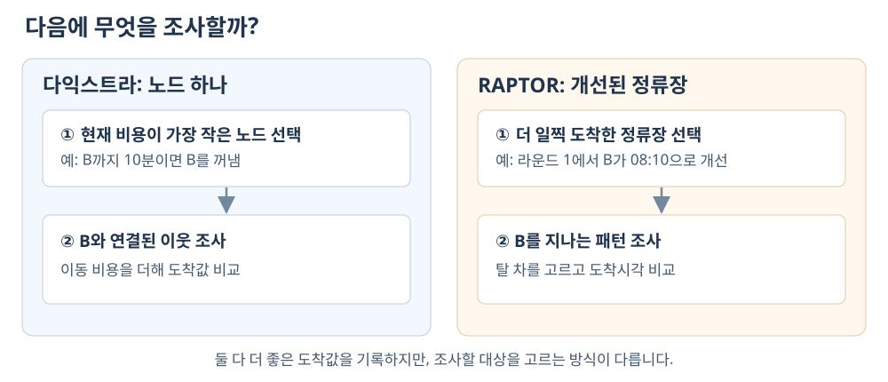

---
jupytext:
  formats: md:myst
  text_representation:
    extension: .md
    format_name: myst
    format_version: 0.13
    jupytext_version: 1.16.4
kernelspec:
  display_name: Python 3
  language: python
  name: python3
---

# 6장 RAPTOR 기반 대중교통 경로 탐색

RAPTOR는 **Round-bAsed Public Transit Optimized Router**의 약자로, ‘라운드 기반 대중교통 최적 경로 탐색기’를 뜻합니다.{cite}`delling_raptor_2015`

RAPTOR는 시간표를 이용해 정류장별 가장 이른 도착시각을 구하는 알고리즘입니다. 먼저 차량에 한 번 타고 도달할 수 있는 정류장을 계산하고, 그 결과로 두 번 타는 경우를 계산합니다. 허용 탑승 횟수를 한 번씩 늘리는 계산 단위를 라운드라고 부릅니다.

정류장 다섯 개와 노선 두 개로 이루어진 시간표에서 시작합니다. A에서 E까지 가는 시간을 손으로 계산한 뒤, 같은 결과를 라운드별 표와 코드로 확인합니다. 기본 구현을 마치면 하남 GTFS의 정류장과 시간표로 실제 노선의 경로를 계산합니다.

{download}`6장 실습 노트북 <../labs/ch06_raptor.ipynb>`도 같은 A–E 시간표를 사용합니다. 직접 채울 파일은 `labs/ch06_raptor.py`이며, 자료 변환은 제공됩니다.

## 학습 목표

- 시간표에서 탈 수 있는 차량을 고르고 도보·대기·차내시간을 계산합니다.
- 같은 차로 이동하기, 하차 뒤 걷기, 다른 차에 타기를 구분해 라운드별 답을 채웁니다.
- 이전 라운드의 답으로 승차를 판단하는 이유를 설명합니다.
- 두 탐색 함수를 구현하고 작은 시간표의 예상 답으로 검증합니다.
- 하남 경로의 결과를 읽고, 다익스트라와 RAPTOR의 탐색 방식을 비교합니다.

## 6.1 먼저 승객의 이동을 계산하기

### A에서 E까지 가는 작은 시간표

08:00에 A 정류장에서 출발해 E로 가려고 합니다. 1호선은 A→B→C, 2호선은 D→E를 지납니다. B에서 D까지는 110초를 걸어서 이동할 수 있습니다. 여기서 1호선·2호선은 학습용 가상 노선입니다.

| 차량 | A | B | C | D | E |
|---|---|---|---|---|---|
| 1호선 첫 차 | 08:00 | 08:10 | 08:20 | — | — |
| 1호선 다음 차 | 08:30 | 08:40 | 08:50 | — | — |
| 2호선 한 편 | — | — | — | 08:15 | 08:25 |

**시간표의 같은 행은 같은 차량의 운행을 나타냅니다.** 이 예제에서는 각 정류장의 도착·출발시각이 같고, 승객이 차량 출발시각까지 도착하면 탈 수 있습니다. 2호선은 표에 적힌 한 편뿐입니다. B↔D 도보 110초는 노트북의 예제 좌표에서 구한 값입니다.


*A에서 E로 가는 경로: 1호선 탑승, B→D 도보, 2호선 탑승.*

E에 가려면 1호선을 타고 B에서 내립니다. C까지 가는 경로와 E로 환승하는 경로는 서로 다른 후보입니다.

| 승객이 하는 일 | 시작 | 끝 | 걸린 시간 |
|---|---|---|---|
| A에서 1호선 탑승, B 하차 | 08:00 | 08:10 | 차내 10분 |
| B에서 D까지 도보 | 08:10 | 08:11:50 | 도보 1분 50초 |
| D에서 2호선 대기 | 08:11:50 | 08:15 | 대기 3분 10초 |
| D에서 2호선 탑승, E 하차 | 08:15 | 08:25 | 차내 10분 |

따라서 E에는 08:25에 도착합니다. 총 25분은 차내 20분, 도보 1분 50초, 대기 3분 10초입니다. **차량에 두 번 탑승했으므로 환승은 한 번입니다.**

### 출발시각을 08:05로 바꾼 경우

A에 08:05에 오면 08:00 차는 이미 떠났습니다. 08:30 차를 타야 하므로 B에는 08:40, C에는 08:50에 도착합니다. B에서 D로 걸어가면 08:41:50입니다. 이때는 2호선의 유일한 08:15 차를 놓쳤으므로 E에 도달할 수 없습니다.

**정류장에 도착한 뒤 탈 수 있는 차량이 있어야 그 경로를 이용할 수 있습니다.** 출발시각을 바꾸면 대기시간과 환승 가능 여부도 달라집니다. 따라서 차량 이동시간만 더하는 계산으로는 두 출발시각의 결과를 구할 수 없습니다.

## 6.2 승객의 이동을 라운드별 계산으로 바꾸기

앞 절에서는 E로 가는 경로 하나의 이동시간을 계산했습니다. RAPTOR는 A·B·C·D·E 각각에 도착할 수 있는 경로를 조사합니다. **라운드 $k$의 결과는 차량에 최대 $k$번 탑승했을 때 각 정류장에 도착할 수 있는 가장 이른 시각입니다.** 정류장마다 결과 칸을 하나씩 두고, 아직 도달할 수 없는 정류장에는 ‘—’를 적습니다.

라운드 0에는 차량을 타지 않은 상태의 시각을 적습니다. 라운드 1에서는 그 시각 이후에 탈 수 있는 차량을 한 번 이용해 도착시각을 계산합니다. 라운드 2에서는 라운드 1에 기록된 시각을 기준으로 차량을 한 번 더 탈 수 있는 경로를 계산합니다. 이전 라운드의 결과도 남겨 두고, 더 이른 시각을 찾은 칸만 바꿉니다. 같은 차량으로 여러 정류장을 가는 것과 하차한 뒤 걷는 것은 탑승 횟수를 늘리지 않습니다.

### 라운드 0: 탑승 전

08:00에 A에 있으므로 A에만 08:00을 적습니다. 다른 칸은 비어 있습니다. 출발지가 정류장 밖에 있다면 정류장까지 걷는 시간도 이 단계에 더합니다. 이 예제는 A에서 바로 시작하므로 접근 도보시간은 0초입니다.

### 라운드 1: 최대 한 번 탑승한 경로

A에서 08:00에 출발하는 1호선을 타면 B에는 08:10, C에는 08:20에 도착합니다. **같은 차량으로 여러 정류장을 지나도 탑승 횟수는 한 번입니다.** B에서 내려 D까지 110초를 걸으면 D에는 08:11:50에 도착합니다. 도보는 탑승 횟수를 늘리지 않으므로 D의 시각도 라운드 1에 기록합니다.

E에 가려면 D에서 2호선에 한 번 더 타야 합니다. 라운드 1에서는 최대 한 번만 탑승하므로 E는 아직 미도달입니다.

### 라운드 2: 최대 두 번 탑승한 경로

라운드 1에서 D에 도착한 시각은 08:11:50입니다. D에서 08:15에 출발하는 2호선을 탈 수 있으므로 E의 도착시각 08:25를 기록합니다. 이 경로에서는 1호선과 2호선에 각각 한 번 탑승했습니다.

C의 08:20도 그대로 남습니다. 두 번 탈 수 있다고 해서 더 늦게 도착하는 경로로 답을 바꾸지 않습니다.

| 저장할 답 | A | B | C | D | E |
|---|---|---|---|---|---|
| 라운드 0 · 탑승 전 | 08:00 | — | — | — | — |
| 라운드 1 · 1번 이하 탑승 | 08:00 | 08:10 | 08:20 | 08:11:50 | — |
| 라운드 2 · 2번 이하 탑승 | 08:00 | 08:10 | 08:20 | 08:11:50 | 08:25 |

**승차 가능 여부는 이전 라운드의 도착시각으로 판단하고, 새 도착시각은 이번 라운드에 기록합니다.** 라운드 1에서 새로 얻은 D의 값으로 곧바로 2호선에 타면, 최대 한 번 탑승한 경로를 기록해야 할 라운드 1에 두 번 탑승한 경로가 섞입니다.

라운드 3에서는 세 번까지 탑승을 허용하지만, 어느 정류장의 도착시각도 더 빨라지지 않아 종료합니다. 라운드 번호는 계산하는 동안 흐른 시간이나 지나간 정류장 수가 아니라 허용하는 최대 탑승 횟수입니다.

### 같은 시간표를 화면에서 확인하기

[RAPTOR 학습 화면 열기](../_static/ch06_raptor.html)에서 ‘작은 시간표로 이해’를 선택하고, ‘첫 차 고르기’부터 9단계를 따라갑니다. ‘도보’와 ‘한 번의 한계’에서 D와 E의 칸을 비교합니다. 라운드 3에서는 더 개선되는 값이 없어 종료하는 과정을 확인합니다. 출발을 08:05로 바꾸면 라운드 2에서 종료하므로 7단계만 실행합니다. 같은 화면의 ‘하남 계산 따라가기’와 ‘도달 범위 탐색’은 6.6절 이후에 사용합니다.

화면의 결과를 다음 세 문장으로 확인합니다.

- C까지 두 구간을 가도 라운드 1인 이유: 같은 차량에 한 번 탔기 때문입니다.
- D는 라운드 1인데 E는 라운드 2인 이유: 도보는 탑승을 늘리지 않지만 2호선 승차는 늘리기 때문입니다.
- 라운드 2에서도 C가 08:20인 이유: 두 번 이하에는 한 번 타는 경로도 포함되기 때문입니다.

코드에서 이 표는 `rounds[k][s]`입니다. `k`는 허용 탑승 횟수, `s`는 정류장 번호입니다. **`rounds[k][s]`에 저장하는 값은 자정 기준 도착시각(초)입니다.** 예를 들어 E의 08:25는 30,300초이고, 출발 08:00의 28,800초를 빼면 통행시간 1,500초입니다. 미도달은 무한대 `INF`로 표시합니다. `max_rounds=5`는 최대 다섯 번 탑승, 대중교통 환승 네 번을 허용합니다.

### 다익스트라와 연결해서 읽기

3장의 다익스트라와 RAPTOR는 모두 더 좋은 후보를 발견하면 기존 답을 바꿉니다. 이 갱신을 완화(relaxation)라고 합니다. 차이는 후보를 만드는 자료와 처리 순서입니다.

3장의 고정 비용 그래프에 A→B 10분, B→D 110초, D→E 10분만 넣으면 합계는 21분 50초입니다. 하지만 08:00 출발 승객의 실제 통행시간은 25분입니다. D에서의 대기 3분 10초가 그래프에 없기 때문입니다.

**다익스트라도 시간표를 반영한 그래프에서 대중교통 경로를 찾을 수 있습니다.** 예를 들어 ‘D에 08:11:50 도착’, ‘D에서 08:15 출발’, ‘E에 08:25 도착’을 서로 다른 노드로 만들고 대기·차내 이동 엣지로 연결하면 됩니다. 이런 시간 확장 그래프는 시간표를 표현할 수 있지만 정류장이 시각별 여러 노드로 늘어납니다. 도착시각에 따라 엣지 비용을 계산하는 시간 의존 다익스트라도 있으며, 이때는 먼저 출발한 사람이 나중에 출발한 사람보다 늦게 도착하지 않는 FIFO 조건 등 적용 조건을 확인해야 합니다.{cite}`bast_routing_2014`

RAPTOR는 시간표를 직접 읽습니다. 같은 정류장 순서를 지나는 운행을 패턴으로 묶고, 직전 라운드에서 도착시각이 개선된 정류장을 지나는 패턴들을 훑습니다. 이렇게 탑승 횟수별로 패턴을 조사하면, 각 탑승 상한에서의 가장 이른 도착시각을 따로 저장할 수 있습니다.{cite}`delling_raptor_2015`



*두 알고리즘은 더 좋은 답을 기록한다는 점이 같고, 다음에 처리할 대상을 고르는 방식이 다릅니다.*

| 비교할 부분 | 3장의 다익스트라 | 이 장의 RAPTOR |
|---|---|---|
| 입력 | 노드·엣지와 고정 소요시간 | 정류장·패턴별 시간표·도보 연결 |
| 저장하는 답 | 노드까지의 최선 소요시간 | k번 이하로 탑승한 최선 도착시각 |
| 다음 처리 대상 | 우선순위 큐의 최소 비용 노드 | 직전 개선 정류장을 지나는 패턴 |
| 후보 계산 | 현재 비용에 엣지 비용을 더함 | 탈 차량의 뒤 정류장 도착시각을 읽음 |
| 종료 | 목적지를 확정하거나 큐가 빔 | 개선이 없거나 탑승 상한에 도달 |

이 장에서는 기다림을 허용하고 차량이 시간표대로 운행한다고 가정합니다. 만차로 인한 승차 실패와 지연은 반영하지 않습니다. 시간표와 이 가정 아래에서 결과를 읽습니다.

## 6.3 시간표에서 탈 차량 고르기

### 운행 패턴과 시간표 배열

1호선의 두 출발편은 모두 A→B→C를 지납니다. 정류장 순서를 한 번 적고 운행별 시각을 행으로 놓을 수 있습니다. **같은 노선에서 정류장 방문 순서가 같은 운행들을 하나의 패턴(pattern)으로 묶습니다.** 5장에서 다룬 패턴을 아래 시간표로 다시 확인합니다.

| 운행 번호 | 위치 0: A | 위치 1: B | 위치 2: C |
|---|---|---|---|
| 0: `L1-1` | 08:00 | 08:10 | 08:20 |
| 1: `L1-2` | 08:30 | 08:40 | 08:50 |

반대 방향 C→B→A가 있다면 별도 패턴으로 둡니다. 그래야 한 패턴의 위치 0, 1, 2가 항상 같은 순서를 가리킵니다. 작은 예제는 1호선 A→B→C와 2호선 D→E의 패턴 두 개입니다.

### 탑승 가능 운행의 탐색

A에 08:03에 도착하면 첫 차 08:00은 이미 떠났으므로 08:30 차를 고릅니다. B에 08:12에 도착했다면 B에서 08:10에 떠난 차는 탈 수 없고, 08:40 차를 기다려야 합니다. **승객이 도착한 정류장의 출발시각 중 준비 시각 이후인 첫 시각을 고릅니다.**

차량을 정한 뒤에는 그 차량의 행을 따라 뒤 정류장의 도착시각을 확인합니다. A에서 08:30 차를 탔다면 B에는 08:40, C에는 08:50에 도착합니다. B에서 다시 차량을 고르는 과정이 아닙니다.

| 승차 정류장 | 준비 시각 | 탈 수 있는 첫 차 |
|---|---|---|
| A | 08:00 | 08:00 |
| A | 08:03 | 08:30 |
| B | 08:12 | 08:40 |
| A | 08:31 | 없음 |

> **실습 코드에서의 표현**  시간표의 한 칸은 `departures[운행][위치]`로 읽습니다. 예를 들어 `departures[1][0]`은 두 번째 운행의 A 출발시각 08:30입니다. `earliest_trip(position, not_before)`는 탈 수 있는 첫 차량의 **운행 번호**를 돌려줍니다. 탈 차가 없으면 `None`을 돌려주므로 첫 운행 번호 `0`과 구분해야 합니다. 노트북 3절에서는 출발시각이 정렬된 경우 `bisect_left`로 찾고, `_sorted`가 거짓이면 출발시각을 직접 훑습니다. 준비 시각과 출발시각이 같아도 탑승할 수 있게 구현합니다.

이 함수는 해당 정류장에서 가장 먼저 탈 수 있는 운행을 찾습니다. 뒤에 출발한 차가 도중에 추월하는 경우에는 먼저 탄 차가 먼저 도착한다는 보장이 없습니다. 이 경우의 처리 한계는 6.6절에서 다룹니다.

### 정류장 색인과 도보 환승 연결

정류장에 도착한 뒤 읽을 패턴과 도보로 갈 정류장도 알아야 합니다. `TransitData.from_gtfs`가 이 목록을 준비합니다. 기본 실습에서는 이 함수의 출력을 확인하고 두 탐색 함수를 작성합니다.

| 자료 | 작은 시간표의 값 | 읽는 방법 |
|---|---|---|
| `index_of` | `"D"` → 3 | D의 답은 도착시각 배열의 3번 칸에 저장합니다 |
| `patterns` | 패턴 0은 A→B→C | 운행별 도착·출발시각을 읽습니다 |
| `routes_by_stop` | D의 항목은 `[(1, 0)]` | 패턴 1의 위치 0부터 조사합니다 |
| `transfers` | B의 항목은 `[(3, 110)]` | B에서 D까지 110초를 더합니다 |

**전체 정류장 목록의 번호와 패턴 안의 위치는 구분해야 합니다.** D의 전체 정류장 번호는 3이고, 2호선 안의 위치는 0입니다. 정류장→패턴 목록은 패턴→정류장 목록을 반대로 찾아보기 위해 만든 역색인입니다. 변수 이름 `routes_by_stop`의 저장 단위도 이 책에서는 패턴입니다.

`routes_by_stop[s]`에서 정류장 `s`를 지나는 패턴을 찾고 그 시간표를 읽습니다. `transfers[s]`에서는 걸어서 갈 수 있는 정류장과 도보시간을 읽습니다.

좌표에서 도보 연결을 만드는 과정은 제공 코드가 처리합니다. 작은 예제에서는 B↔D만 연결되며 편도 시간이 110초입니다. 준비 함수를 직접 구현하는 일은 6.7절의 심화 과제입니다.

## 6.4 RAPTOR의 라운드별 갱신

6.2절에서는 라운드별 표를 손으로 채웠습니다. 이제 같은 표를 코드로 채웁니다. 먼저 이전 답과 이번 답을 나누고, 그다음 조사할 패턴을 고르는 순서로 읽습니다.

08:00에 A에서 출발할 때 초기 배열은 `[08:00, INF, INF, INF, INF]`입니다. `INF`는 아직 경로를 찾지 못했다는 뜻입니다. 이후 계산에서 도착 가능한 시각을 구하면 해당 칸을 갱신합니다.

### 라운드별 상태와 도착시각 배열

탐색은 정류장별 가장 이른 도착시각 `best`와 라운드별 답 `rounds`를 저장합니다. 아직 발견하지 못한 정류장은 무한대입니다. 라운드 0에는 `출발시각 + 접근 도보시간`을 기록합니다.

라운드 2에서는 최대 두 번 탑승한 경로를 찾습니다. 한 번만 타고 도착하는 좋은 경로도 여전히 유효하므로 라운드 1의 결과를 남겨 둡니다. 여기에 두 번째 차량을 타서 더 빨리 도착하는 경로가 있으면 그 정류장의 답을 바꿉니다. **라운드 번호는 정확한 탑승 횟수가 아니라 허용하는 최대 탑승 횟수입니다.**

이전 경로를 후보로 유지하기 위해 새 라운드는 이전 답을 복사해 시작합니다.

```python
prev = rounds[k - 1]
cur = list(prev)
```

**`prev`는 승차 판단에 읽고, `cur`는 새 도착시각을 기록할 때 씁니다.** A→B를 탄 직후의 `cur[B]`로 다른 차에 다시 타면 한 라운드에서 두 번 탑승하게 됩니다. 이를 막기 위해 `prev`는 라운드가 끝날 때까지 바꾸지 않습니다.

아래 그림에서 D의 08:11:50은 라운드 1의 결과 칸에 있습니다. 이 값이 라운드 2의 승차 판단으로 넘어가야 2호선을 타는 일이 두 번째 탑승으로 계산됩니다.


*승차 판단에 쓰는 이전 값과 새 도착시각을 적는 현재 값. 주황색 결과는 다음 라운드에서 파란색 승차 판단의 입력이 됩니다.*

### 첫 번째 라운드의 갱신 과정

이전 답은 `[08:00, 미도달, 미도달, 미도달, 미도달]`입니다. 이를 복사해 현재 답을 시작합니다. 아래 표에서 ‘이전 답’은 한 라운드 동안 고정되어 있습니다.

| 처리할 일 | 읽는 자료 | 선택·갱신 결과 |
|---|---|---|
| A에서 탈 차 찾기 | A 08:00 | 1호선 운행 0을 선택 |
| 같은 차로 B 도착 | A에서 선택한 운행의 B 도착시각 | B 08:10 |
| 같은 차로 C 도착 | 같은 운행의 C 도착시각 | C 08:20 |
| B에서 D까지 도보 | 이번에 얻은 B 08:10 | D 08:11:50 |
| 라운드 1 종료 | 이전 답은 그대로 | E는 여전히 미도달 |

B의 `prev`가 `INF`여도 A에서 선택한 운행의 B 도착시각은 읽을 수 있습니다. **새로 승차할 때는 `prev`를 확인하지만, 이미 선택한 운행의 하차시각은 시간표에서 읽습니다.** 따라서 B의 `prev`가 `INF`라는 이유로 운행 선택을 취소하지 않습니다.

D의 08:11:50은 현재 답에만 있습니다. 이 값을 즉시 2호선 승차에 쓰면 한 라운드에서 두 번 타게 됩니다. 라운드 1을 끝내고 이 표를 다음 이전 답으로 넘긴 뒤에야 D에서 08:15 차를 선택합니다. 그 결과 라운드 2의 E에 08:25를 기록합니다.

**`cur`를 수정해도 `prev`가 바뀌지 않도록 별도의 목록을 만들어야 합니다.** `cur = prev`는 같은 목록을 가리키므로, `cur = list(prev)`로 복사합니다. `best`는 지금까지 얻은 가장 이른 시각이며, 새로운 도착이 이 값보다 빠를 때만 기록합니다.

### 탐색 대상 패턴의 선택

이전 라운드보다 더 일찍 도착하게 된 정류장에서는 전에는 놓쳤던 차를 탈 수 있습니다. 따라서 이번 라운드에서는 **도착시각이 개선된 정류장을 지나는 패턴**을 조사합니다. 개선된 정류장을 지나지 않는 패턴은 같은 조건으로 다시 조사할 필요가 없습니다.

코드에서는 개선된 정류장을 `marked`에 저장합니다. 각 정류장의 `routes_by_stop`을 읽어 조사할 패턴을 모읍니다. 같은 패턴이 B와 C에서 모두 선택되면 더 앞의 B 위치부터 한 번 훑습니다. `marked`는 처리 완료 목록이 아닙니다. 같은 정류장의 도착시각이 다음 라운드에서 다시 개선되면 또 들어갑니다.

A에서 출발한 라운드 1에서는 1호선만 읽으면 됩니다. 그 결과 B·C·D가 개선되면 라운드 2에서 1호선과 2호선을 읽습니다. 앞서 읽은 패턴이라도 더 이른 도착시각으로 다른 운행에 탈 수 있으므로 다시 조사할 수 있습니다.

### 패턴 탐색과 승하차 시각 갱신

패턴을 훑는 과정은 한 승객의 이동을 그대로 재생하는 것이 아니라, **여러 승차 위치에서 시작하는 경로 후보를 비교하는 과정**입니다. A에서 차량에 타는 경로와 B까지 다른 방법으로 도착한 뒤 B에서 차량에 타는 경로를 비교할 수 있습니다. 고려하는 운행을 바꾼다는 것은 이미 탄 차에서 갈아탄다는 뜻이 아니라, 뒤 정류장까지 비교할 경로 후보를 바꾼다는 뜻입니다.

다음 작은 시간표는 앞의 A–E 예제와 별개입니다. 앞 라운드에서 A에는 08:05에, B에는 다른 경로로 08:08에 도착했다고 합시다. 두 차는 모두 A→B→C 순서로 운행합니다.

| 운행 | A 출발 | B 출발 | C 도착 |
|---|---|---|---|
| 이른 차 | 08:00 | 08:10 | 08:20 |
| 늦은 차 | 08:30 | 08:40 | 08:50 |

A에서 새로 타려면 이른 차를 놓쳤으므로 늦은 차를 선택합니다. 하지만 B에 08:08에 도착한 **다른 경로 후보**는 B에서 08:10에 떠나는 이른 차를 탈 수 있습니다. 패턴을 A에서 B로 훑으며 고려하는 운행을 늦은 차에서 이른 차로 바꾸면 C의 후보 도착시각도 08:50에서 08:20으로 바뀝니다. 두 후보 모두 *앞 라운드의 도착* 뒤에 차량을 한 번 더 타므로 이번 라운드에 속합니다.

코드에서는 현재 고려하는 운행 번호를 `trip`에 저장합니다. 패턴을 따라 다음 정류장으로 이동할 때 그 차에서 내리는 경우를 계산합니다. 더 일찍 도착하면 `cur`와 `best`를 갱신하고 정류장을 표시합니다.

```python
if trip is not None:
    arrive = pattern.arrivals[trip][position]
    if arrive < best[stop]:
        best[stop] = cur[stop] = arrive
        new_marked.add(stop)
```

그다음 `prev[stop]`에 준비된 승객이 탈 수 있는 운행을 찾습니다. 현재 고려하는 차보다 더 이르게 떠나는 차가 있으면, 그 정류장에서 새로 타는 경로 후보로 바꿉니다. 위 표에서는 B에 08:08에 도착한 후보가 이른 차를 선택하는 경우입니다.

이 설명에서는 같은 패턴의 운행이 도중에 서로 추월하지 않는다고 가정합니다. 이 조건이면 먼저 탈 수 있는 차를 따라가는 방식으로 뒤 정류장의 이른 도착을 찾을 수 있습니다. 뒤에 출발한 차가 추월한다면 후보를 하나만 유지하는 방식으로 더 빠른 도착을 놓칠 수 있습니다.

### 도보 환승과 탐색 종료 조건

패턴을 읽은 뒤에는 새로 도착한 정류장에서 도보 연결을 적용합니다. 작은 시간표에서는 B의 08:10에 110초를 더해 D를 08:11:50으로 갱신합니다. 이 도보는 탑승 횟수를 늘리지 않으므로 같은 라운드에 들어갑니다. D에서 2호선에 타는 판단은 다음 라운드에서 합니다.

실습은 하차 뒤 도보 연결을 한 차례 완화하는 간소화된 구현입니다. 도보만 이어 걸어가는 모든 경로를 별도의 최단경로 탐색으로 계산하지는 않습니다. 작은 예제에서는 B↔D만 연결되어 있어 이 차이가 없습니다. 보행망에서 도보를 연속으로 허용하려면 정류장 사이의 도보 최단시간을 미리 구하거나 하차 뒤에 도보 탐색을 수행합니다.

**개선된 정류장이 없거나 허용 탑승 횟수에 도달하면 탐색을 끝냅니다.** 개선된 정류장이 없으면 다음 라운드에서 조사할 새 후보도 없습니다. 개선이 남은 상태에서 `max_rounds`에 도달했다면, 결과는 그 탑승 상한 안에서 구한 답입니다.

목적지에 도달한 라운드 뒤에도 더 빠른 답이 나올 수 있습니다. 6.6절의 하남 예제도 라운드 1의 08:26:24가 라운드 2에서 08:22:52로 개선됩니다. **목적지에 처음 도달한 뒤에도 다음 라운드에서 더 빠른 경로를 찾을 수 있습니다.**

### 다익스트라와 연결하기

3장의 `nd < dist[v]`와 여기의 `arrive < best[stop]`은 모두 더 좋은 후보를 찾았는지 비교합니다. 다익스트라는 엣지 비용을 더해 후보를 만들고, RAPTOR는 시간표에서 차량의 도착시각을 읽습니다. 다익스트라는 최소 비용 노드를 확정한 뒤 그 이웃을 조사합니다. RAPTOR는 직전 라운드에서 개선된 정류장을 지나는 패턴을 조사하며, 같은 정류장을 다음 라운드에서 다시 개선할 수 있습니다.

자료를 읽는 방법도 다릅니다. 3장의 `graph.neighbors(u)`는 다음 노드와 엣지 비용을 돌려줍니다. RAPTOR의 `routes_by_stop[s]`는 정류장 `s`를 지나는 패턴을 찾고, `transfers[s]`는 도보로 갈 수 있는 정류장과 시간을 찾습니다.

> **코드에서 이름이 같은 변수**  3장의 `prev[v]`는 경로를 거슬러 찾기 위한 이전 노드였습니다. 여기의 `prev[s]`는 이전 라운드의 도착시각입니다. 경로 복원용 기록은 6.6절의 `journey`에서 따로 읽습니다.

[작은 시간표 화면](../_static/ch06_raptor.html)의 ‘코드로 연결하기’를 펼치면 같은 A–E 예제의 `prev`와 `cur`를 나란히 볼 수 있습니다. ‘한 번의 한계’에서 D는 `cur`에만 있고, ‘두 번째 차’로 넘어가면 `prev`에도 나타납니다. 하남 자료의 패턴 선택과 개별 갱신은 6.6절의 화면에서 확인합니다.

## 6.5 RAPTOR 구현과 검증

구현을 확인하기 전에 작은 시간표에서 예상 답을 정합니다. C는 08:20에 환승 0회, E는 08:25에 환승 1회입니다. 출발을 08:05로 바꾸거나 접근 도보를 추가했을 때도 어느 차를 탈 수 있는지 손으로 계산합니다. 노트북에서 이 답을 구현 결과와 대조합니다.

| 확인 조건 | C의 예상 도착 | E의 예상 도착 | 확인하는 부분 |
|---|---|---|---|
| A 08:00, 최대 2번 탑승 | 08:20 | 08:25 | 직통과 도보 환승 |
| A 08:00, 최대 1번 탑승 | 08:20 | 미도달 | 라운드 제한 |
| A 08:05, 최대 2번 탑승 | 08:50 | 미도달 | 놓친 차 제외 |
| 07:55 출발, A까지 도보 10분 | 08:50 | 미도달 | 접근 도보 포함 |
| A 23:00 출발 | 미도달 | 미도달 | 마지막 운행 뒤 출발 |

노트북 4절에서는 라운드 0과 1의 배열을 먼저 채웁니다. 그다음 `labs/ch06_raptor.py`의 `raptor`에서 초기화, 패턴 선택, 승하차, 도보, 종료 순서로 구현합니다. 각 단계의 입력과 갱신할 값을 6.4절 표와 대조합니다.

기본 제출에서 직접 작성할 함수는 `Pattern.earliest_trip`과 `raptor` 두 개입니다. `TransitData.from_gtfs`는 제공된 채로 사용해도 자가 채점을 통과할 수 있습니다. 준비한 패턴은 학생의 `earliest_trip`을 호출하므로 출발편 선택도 함께 검사됩니다.

**작은 시간표의 예상 답과 다른 결과가 나오면, 그 차이로 잘못된 갱신을 찾습니다.** E가 라운드 1에 나온다면 `prev`와 `cur`를 섞었는지 확인합니다. 08:05 출발에도 C가 08:20이라면 이미 출발한 차를 선택했는지 확인합니다. 이 사례들을 통과한 뒤에는 하남 자료에서도 결과를 검사합니다.

실습 파일은 도착시각 배열을 반환하고 제공된 `raptor`는 `RaptorResult`를 반환합니다. 노트북에서 학생 구현의 배열은 제공된 함수의 `result.best`와 비교합니다. 경로 복원용 기록은 제공된 구현을 사용합니다.

## 6.6 하남 GTFS 기반 경로 탐색

작은 시간표에서 구현을 확인했으면 하남 자료로 경로 한 건을 계산합니다. 출력에서 출발지 접근 도보, 차량 탑승, 환승 도보, 마지막 하차를 순서대로 확인합니다.

실습 노트북은 하남시청 좌표 `(37.5393, 127.2148)`에서 접근 가능한 정류장을 고릅니다. 목적지는 미사역 부근 좌표 `(37.5606, 127.1930)`에 가장 가까운 정류장입니다. 파일에서 선택되는 이름은 ‘미사강변브라운스톤’입니다. **경로가 끝나는 지점은 목적지 좌표에서 가장 가까운 정류장입니다.**

오전 8시 질의에서 제공된 구현은 4,203개 중 4,156개 정류장에 유한한 도착시각을 반환합니다. 이 수에는 출발지에서 걸어 도착한 정류장도 들어 있습니다. 시간 제한 없이 주어진 시간표와 최대 다섯 번 탑승으로 찾은 수이며, 30분 안에 갈 수 있는 정류장 수와는 다릅니다.

`journey`는 목적지에서 출발지로 기록을 거슬러 경로를 복원합니다. 기록에는 이용한 패턴과 운행, 승하차 위치, 도보 연결이 들어 있습니다. `summarize`로 요약하면 이 질의는 약 22.9분이고 차내시간 6.6분, 도보시간 11.2분, 대기시간 5.1분입니다.

대기시간은 총 통행시간에서 도보와 차내시간을 뺀 값입니다. 도보가 1분 길어져 예정한 차를 놓치면 다음 운행까지 기다려야 합니다. **도보시간의 변화는 환승 가능 여부를 바꾸어 총 통행시간에 영향을 줍니다.** 출발을 5분 늦춰 비교하는 작업은 추가 탐색 노트북에서 진행합니다.

선택된 정류장에서 목적지 좌표까지의 마지막 도보는 이 결과에 포함되지 않습니다. 자동차와 대중교통의 통행시간을 비교하려면 출발지·목적지를 맞추고, 주차 후 도보와 하차 후 도보처럼 빠진 구간도 포함해야 합니다.

### 실제 경로에서 라운드를 비교하기

[하남 계산 따라가기](../_static/ch06_raptor.html#lesson)를 엽니다. 작은 A–E 예제를 실제 정류장으로 확장한 화면입니다. 두 후보 경로에 필요한 2번·9304번·서울 5호선 구간과 도보 연결만 추렸으며, 정류장 순서와 차량 시각은 교재의 GTFS에서 가져왔습니다.

| 허용 탑승 횟수 | 미사역 부근까지의 후보 경로 | 도착 정류장 시각 |
|---|---|---|
| 1번 이하 | 9304번 탑승 + 도보 | 08:26:24 |
| 2번 이하 | 2번 버스 + 도보 + 서울 5호선 + 도보 | 08:22:52 |

환승을 한 번 허용하자 3분 32초 빠른 경로를 찾았습니다. 목적지에 첫 도착 답을 찾은 뒤에도 허용 탑승 횟수 안에서 더 빠른 후보를 확인해야 합니다.

‘다음 계산’을 누르면 패턴 선택, 승차 판단, 하차시각 갱신, 도보 연결을 차례로 확인합니다. A–E 예제의 B→D 도보에 해당하는 구간은 2번 버스 하차 후 하남시청역까지 걷는 구간입니다. 그 도착시각은 이번 답에 기록되고, 5호선 탑승은 다음 라운드의 이전 답으로 판단합니다.

### 모형의 가정과 적용 한계

이 구현은 5장에서 다룬 운행일 필터를 적용하지 않습니다. 승하차 금지 필드, 정류장별 최소 환승시간, 차량 지연도 처리하지 않습니다. 같은 정류장에서는 도착과 출발이 같은 시각이어도 환승할 수 있습니다.

하남 자료에는 패턴 안에서 운행 간 시각 순서가 뒤집히는 사례도 있습니다. 출발시각을 직접 훑는 처리는 이분 탐색의 정렬 문제를 피하지만, 추월하는 모든 운행의 최선 도착을 보장하지는 않습니다. **하남 결과를 해석할 때는 운행일·도보 연결·추월 처리의 가정을 함께 확인해야 합니다.** 이 문제를 처리하는 한 방법은 추월이 있는 패턴을 추월 없는 묶음들로 나눈 뒤 각 묶음을 탐색하는 것입니다.

## 6.7 도달 범위 분석과 자료구조 구성

{download}`추가 탐색 노트북 <../labs/extensions/ch06_raptor_exploration.ipynb>`을 엽니다. 필요한 하남 자료를 처음부터 읽으므로 기본 노트북의 실행 상태가 필요하지 않습니다.

### 도달 범위 분석과 결과 검증

한 번의 질의는 목적지 하나뿐 아니라 모든 정류장의 도착시각 배열을 돌려줍니다. **정류장 도착시각에서 질의 출발시각을 빼면 도보·대기·차내시간을 합한 통행시간입니다.** 30분·45분·60분 이하인 정류장을 지도에 표시하면 시간 한도에 따라 도달 범위가 어떻게 넓어지는지 볼 수 있습니다.

출발시각과 시간 한도를 고정하면 허용 탑승 횟수에 따른 도달 범위도 비교할 수 있습니다. 출발시각을 $t_0$, 시간 한도를 $T$라 하면, 정류장 $s$가 라운드 $k$의 도달 범위에 포함되는 조건은 $\mathrm{rounds}[k][s]-t_0\le T$입니다. **라운드 2의 30분 도달 범위는 최대 두 번 탑승하고 출발 후 30분 안에 도달하는 정류장들입니다.** 이전 답을 유지하므로 같은 시간 한도의 범위는 라운드를 늘려도 줄어들지 않습니다. 하남시청에서 08:00에 출발하면 30분 이내 도달 정류장은 라운드 1에서 355곳, 라운드 2에서 451곳입니다.

면 형태의 등시선을 만들려면 정류장 도착 후 목적지까지의 도보를 더합니다. 각 위치에서 `정류장까지의 최선 도착시각 + 그 정류장에서 걷는 시간`의 최솟값을 구해 시간 한도와 비교합니다. [접근성·등시선 화면](../_static/ch06_raptor.html#accessibility)은 마지막 도보를 최대 500m로 제한하고 직선거리·우회계수로 주변 영역을 근사합니다. 실제 보행로와 하천 횡단 가능 여부를 반영한 등시선과는 구분합니다. 이 범위 안의 인구·일자리·시설 수를 합하면 접근성 지표로 확장할 수 있습니다.

3장의 도로망 도달 범위와 달리 여기에는 차량을 기다리는 시간이 포함됩니다. 출발시각을 08:00에서 08:05로 바꾸면 같은 정류장에서도 결과가 달라질 수 있습니다. 지도에서 같은 시간대의 점을 비교하면 어느 방향에서 버스나 철도의 연결을 이용하는지 살펴볼 수 있습니다.

실습 지도는 도달 가능한 정류장 점을 표시합니다. 점 사이의 모든 장소까지 그 시간 안에 걸어갈 수 있다는 뜻은 아닙니다. 정류장이 많은 곳과 접근 가능한 인구가 많은 곳도 같은 개념은 아닙니다.

추가 탐색 노트북에서는 08:00 출발·30분 이내 조건에서 탑승 상한을 늘리고, 도달 정류장 수와 지도를 함께 비교합니다. 03:00 출발도 첫차를 기다렸다가 갈 수 있지만, 30분이라는 시간 한도를 두면 기다리는 동안 한도가 끝날 수 있습니다.

실제 자료에서는 손으로 모든 답을 확인하기 어려우므로 다음 조건을 검사합니다. 출발 전 도착이 없어야 하고, 허용 탑승 횟수를 늘렸을 때 최선 도착이 늦어져서는 안 됩니다. 출발을 늦췄는데 더 이르게 도착하는 정류장이 있는지도 확인합니다.

마지막 조건은 같은 시간표·접근 조건·탑승 제한에서 기다림을 허용할 때 성립합니다. 일찍 출발한 사람은 늦게 출발한 사람의 차를 기다렸다가 탈 수 있기 때문입니다. 검사에서는 미도달을 무한대로 두어, 일찍 출발했을 때만 미도달인 경우도 잡습니다. 이 검사는 결과의 모순을 찾는 데 쓰며, 모든 최적 경로를 찾았다는 보장은 아닙니다.

실행시간은 시간표 준비와 질의로 나누어 측정합니다. 같은 데이터로 반복 질의할 때는 `TransitData`를 재사용합니다. 실행시간을 비교할 때는 목적지 한 곳을 찾는 질의인지, 모든 정류장을 찾는 질의인지도 맞춰야 합니다.

### GTFS 자료 변환의 구현

기본 탐색을 완성했다면 제공된 `TransitData.from_gtfs`를 직접 작성해 봅니다. 먼저 `stop_id`를 배열 번호로 바꾸고, 운행별 방문 순서를 만들고, 같은 순서끼리 묶습니다. 그다음 패턴별 시각 배열과 정류장→패턴 역색인을 만듭니다. 한 단계마다 작은 예제의 패턴 두 개와 시각을 확인합니다.

도보 연결은 자료 변환의 마지막 단계에서 만듭니다. 하남 실습 자료에는 `transfers.txt`가 없어 좌표 사이 직선거리에 1.35를 곱합니다. 보정 거리가 500m 이하인 쌍을 골라 1.2m/s로 나누고 초를 올림합니다. 출발지 접근은 보정 거리 800m 이하에서 가까운 정류장 최대 30개를 씁니다.

**직선거리로 만든 도보 연결은 실제로 걸어서 이동할 수 있는지를 보장하지 않습니다.** 이 구현은 하천·횡단보도·출입구·계단을 반영하지 않습니다. 하남 자료의 도보 연결 28,818개는 방향을 구분한 수이며 B→D와 D→B는 두 개로 셉니다. 제공 코드에서 쓰는 공간 검색 도구는 후보를 줄이는 역할이며 기본 실습에서는 제공된 코드를 사용합니다.

심화 제출물은 직접 작성한 변환 함수와 기본 자가 채점 출력입니다. 교체하기 전과 후의 작은 시간표 결과가 같아야 합니다. 기본 구현 과제와 신규 노선 통합 과제는 이 심화를 마치기 전에도 진행할 수 있습니다.

## 6.8 통합 과제: 신규 노선의 도입 효과 분석

통합 과제에서는 5장에서 작성한 신규 노선 시간표를 기존 GTFS에 추가하고, 이 장의 RAPTOR로 도입 전후 경로를 계산합니다. {download}`과제 노트북 <../projects/gtfs_route_design/route_design.ipynb>`에 시간표 생성·저장과 경로 비교 과정이 포함되어 있습니다.

첫 단계는 가상 하남 셔틀의 정류장 순서와 배차간격을 정해 ZIP으로 저장하는 일입니다. **신규 노선 도입 전후를 비교할 때는 운행일·출발시각·출발 정류장·도착 정류장·탑승 상한을 같게 둡니다.** 원래 하남 자료를 보존하고 각 안을 복사본에 한 번씩 추가합니다.

처음에는 08:00과 08:10 두 경우의 경로를 읽습니다. 기본안의 셔틀은 08:05에 출발하므로 앞의 승객은 탈 수 있고 뒤의 승객은 놓칩니다. 두 경우의 차이를 확인한 뒤 24개 출발시각에서 결과를 계산합니다. 마지막에는 배차간격을 20분에서 10분으로 바꾸고 통행시간과 운행 편수를 비교합니다.

노트북의 초기 설정에서 신규 셔틀을 추가하면, 08:00 통행시간은 22.9분에서 17분으로 줄고 환승은 1회에서 0회로 줄어듭니다. 08:10에는 18.6분과 환승 2회가 유지됩니다. 이 비교는 정류장 출발이므로 6.6절의 건물 좌표에서 접근하는 조건과 구분합니다.

통합 과제의 제출물은 GTFS ZIP, 설계 조건표, 노선도, 전후 비교표·그래프와 해석입니다. 자세한 조건은 {download}`과제 안내 <../projects/gtfs_route_design/README.md>`에 있습니다. 배차간격을 줄이면 운행 편수가 늘어나므로 통행시간 단축량과 운행 편수를 함께 적습니다.

## 이 장의 실습

{download}`6장 실습 노트북 <../labs/ch06_raptor.ipynb>`에서 두 탐색 함수를 구현합니다. 손으로 계산한 도착시각을 구현 결과와 대조합니다.

| 단계 | 코드 실행 전에 확인할 것 |
|---|---|
| 다익스트라와 시간표 결과 비교 | 차내·도보시간만 더하면 어떤 대기와 놓친 차가 빠지는가 |
| 시간표 읽기와 손계산 | B→D 도보 뒤 08:15 차를 탈 수 있는가 |
| 제공된 자료 읽기 | D의 전체 번호 3과 패턴 안 위치 0의 차이 |
| `earliest_trip` 구현 | 정각·다음 차·마지막 차 이후의 운행 번호 |
| 라운드 1 손계산 | D는 도달하고 E는 아직 미도달인 이유 |
| `raptor` 구현·검증 | 승차에 `prev`, 새 기록에 `cur`를 쓰는 이유 |
| 하남 경로 한 건 해석 | 도보·대기·차내시간의 합계 |

`labs/ch06_raptor.py`의 두 함수를 작성한 뒤 자가 채점을 실행합니다.

```bash
python labs/check.py ch06
```

빈칸 상태에서도 제공된 자료 변환 검사는 통과할 수 있습니다. 탐색 검사를 모두 통과해야 기본 구현이 완료된 것입니다. 제출물은 작성한 `.py` 파일, 채점 출력, 작은 시간표의 세 조건을 설명한 메모입니다.

[하남 도달 범위 탐색 화면](../_static/ch06_raptor.html#accessibility)과 추가 탐색 노트북은 선택 활동입니다. 신규 노선 통합 과제에서는 직접 만든 GTFS를 기존 시간표에 추가해 효과를 비교합니다.

## 정리

- 시간표에서는 승객의 준비 시각 이후에 출발하는 차량을 골라야 합니다. 출발시각이 달라지면 대기와 환승 가능 여부도 달라집니다.
- `rounds[k]`는 k번 이하로 탑승한 가장 이른 도착시각입니다. 같은 차량의 다음 정류장과 하차 후 도보는 같은 라운드에 포함됩니다.
- 승차 판단에는 `prev`를 읽고, 새 도착시각은 `cur`에 기록합니다. 다음 라운드는 그 결과를 복사해서 시작합니다.
- 목적지에 처음 도달한 뒤에도 더 빠른 경로가 나올 수 있습니다. 개선이 없거나 탑승 상한에 도달하면 종료합니다.
- 실제 자료의 결과는 운행일, 도보 연결, 운행 간 추월에 대한 처리 범위 안에서 해석합니다.
- 7장에서는 이 경로에 요금을 계산하고, 시간·요금·환승 횟수로 수단 선택확률을 구합니다.

## 참고 문헌

```{bibliography}
:filter: docname in docnames
```
