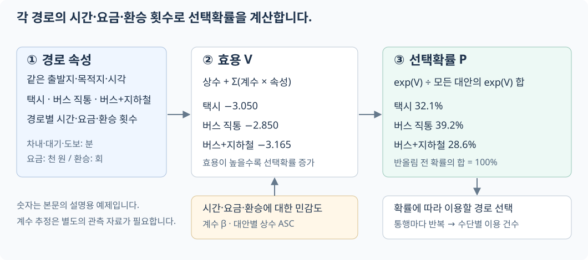

# 7장 환승·요금과 수단 선택

6장에서 계산한 하남시청→미사역 부근 정류장의 통행시간은 약 23분이었습니다. 이 가운데 약 11분은 걷고, 약 5분은 기다리는 데 썼습니다. 환승을 더 허용하거나 정류장 사이를 더 멀리 걸을 수 있다면 도착시각이 빨라질까요? 이 장에서는 두 조건을 바꾸어 경로를 비교하고, 각 경로의 요금을 계산합니다.

이후에는 같은 출발지와 목적지의 택시·버스 직통·버스와 지하철 환승 경로를 비교합니다. 가장 빨리 도착하는 경로와 이용자가 선택할 경로는 다를 수 있습니다. 시간·요금·환승 횟수에 대한 선호를 계수로 표현하고, 다항 로짓(MNL)으로 각 대안의 선택확률을 계산합니다.

## 학습 목표

- 환승 허용 횟수와 도보 환승거리가 도달 정류장 수와 도착시각에 미치는 영향을 계산합니다.
- 교육용 요금 모형의 기본요금과 거리 가산액을 손으로 검산합니다.
- 통행시간·차내시간·도보·대기·환승·요금의 분포를 해석합니다.
- 경로 속성과 선호 계수를 구분하고, 효용과 MNL 선택확률을 계산합니다.
- 선택확률을 수요로 해석할 때 필요한 자료와 모형의 한계를 설명합니다.

## 7.1 환승 허용 횟수와 도달 범위

6장에서는 최대 다섯 번 탑승, 즉 환승 네 번을 허용했습니다. 이번에는 환승 상한을 0회부터 4회까지 바꾸면서 도달 가능한 정류장 수를 비교합니다.

| 허용 환승 횟수 | 도달 정류장 수 |
| --- | ---: |
| 0회 | 1,679개 |
| 1회 이하 | 4,152개 |
| 2회 이하 | 4,156개 |
| 3회 이하 | 4,156개 |
| 4회 이하 | 4,156개 |

하남시청에서 오전 8시에 출발하는 조건입니다. 두 번까지 환승을 허용하면 4,156개 정류장에 도달하며, 상한을 더 높여도 도달 정류장 수는 늘지 않습니다.

여기서 센 것은 시간 제한 없이 도달할 수 있는 정류장 수입니다. 도달 정류장 수가 같아도 환승을 더 허용하면 도착시각이 빨라질 수 있습니다. 이미 갈 수 있는 정류장에 더 빠른 경로가 생겨도 개수는 그대로이기 때문입니다. 7.6절에서는 표본 경로의 환승 횟수와 통행시간을 함께 확인합니다.

이 출발지와 시간에서는 환승을 한 번 허용할 때 도달 정류장 수가 크게 늘었습니다. 다른 출발지나 출발시각에서도 같은 결과가 나오는지는 따로 계산해야 합니다.

> **탐구**
>
> 프로젝트에서는 몇 개의 출발지와 출발시각을 골라 탑승 상한을 바꾸어 봅니다. 도달 정류장 수, 도착시각 개선량, 계산시간을 함께 비교한 뒤 허용 환승 횟수를 정합니다.

## 7.2 도보 환승거리와 경로 변화

6장에서는 가까운 정류장 사이를 도보로 연결했습니다. 환승거리 상한을 200m, 500m, 1,000m로 바꾸고 연결 수와 도달 정류장 수를 비교합니다.

| 도보 환승거리 상한 | 도보 연결 수 | 도달 정류장 수 |
| --- | ---: | ---: |
| 200m | 7,818쌍 | 4,147개 |
| 1,000m | 92,574쌍 | 4,162개 |

환승거리 상한을 늘리면 도보 연결 수는 크게 늘지만, 도달 정류장은 15개 늘어납니다.

두 설정에서 모두 갈 수 있는 정류장 가운데 1,414개는 환승거리 상한이 1,000m일 때 더 일찍 도착합니다. 이 정류장들에서 줄어든 통행시간의 중앙값은 약 6분입니다. 새로 갈 수 있는 곳은 적어도, 이미 갈 수 있던 곳에 더 빨리 도착하는 효과는 있습니다.

이 모형의 환승거리 상한은 직선거리에 우회계수 1.35를 곱한 보정 거리에 적용됩니다. 기본 상한 500m를 보행속도 1.2m/s로 나누면 도보시간은 최대 약 7분입니다. 허용 거리를 늘리면 더 먼 정류장 사이의 환승도 후보에 포함됩니다.

> **주의**
>
> 거리 조건을 만족해도 실제로 걸어서 갈 수 있다는 보장은 없습니다. 예를 들어 직선거리 300m인 두 정류장은 보정 거리 405m로 기본 상한 안에 들어갑니다. 그러나 중간에 건널 수 없는 강이나 철길이 있으면 실제 환승은 불가능합니다. 실제 이동 가능성을 판단하려면 보행로의 연결 여부를 확인해야 합니다.

## 7.3 경로에 요금 계산하기

버스에서 지하철로 갈아탈 때마다 기본요금을 전부 다시 내는 것은 아닙니다. 수도권 통합환승할인이 적용되면 이용 수단 중 가장 높은 기본요금을 기준으로 삼고, 환승 통행의 총 이동거리에 따라 가산액을 냅니다. 할인 적용에는 교통카드 사용, 하차 후 다음 승차까지의 시간 등 조건이 있습니다([서울시 통합환승할인 안내][seoul-fare]).

여기서는 환승 할인이 인정된다고 가정하고, 기본요금과 거리 가산액만 계산합니다. 계산 규칙은 다음 세 가지로 단순화합니다.

1. 이용한 수단 중 가장 높은 기본요금을 적용합니다.
2. 차량으로 이동한 총거리가 10km 이하면 기본요금만 계산합니다.
3. 10km 초과분은 5km 단위로 올림해 블록당 100원을 더합니다. GTX가 포함되면 블록당 250원을 더합니다.

교육용 모형의 기본요금은 버스 1,500원, 도시철도 1,550원, GTX 3,200원으로 고정되어 있습니다.

환승이 인정된 하나의 통행이라고 가정하면 실습 요금은 다음과 같습니다. $M$은 이용한 대중교통 수단의 집합, $b_m$은 수단 $m$의 기본요금, $D$는 차량 이동거리의 합(km)입니다. $q$는 5km당 가산액으로, GTX가 없으면 100원, 있으면 250원입니다.

$$
F_{\mathrm{실습}} = \max_{m\in M} b_m
  + q\left\lceil\frac{\max(0,D-10)}{5}\right\rceil
$$

버스 3km와 지하철 4km를 각각 별도 통행으로 결제하면 기본요금은 1,500 + 1,550 = 3,050원입니다. 환승 할인이 인정되면 두 기본요금 중 높은 1,550원만 냅니다. 총거리가 7km이므로 거리 가산액은 없습니다.

거리 가산 블록 수는 **올림**으로 계산합니다. 버스와 지하철을 합쳐 10.1km를 이동하면 초과분 0.1km를 한 블록으로 세어 100원을 더합니다.

| 버스 3km + 지하철 4km의 결제 조건 | 기본요금 계산 | 합계 |
| --- | --- | ---: |
| 각각 별도 통행 | 1,500 + 1,550 | 3,050원 |
| 환승이 인정된 하나의 통행 | 높은 기본요금 한 번 적용 | 1,550원 |

이번에는 버스만 이용하면서 총거리를 바꿉니다.

| 차량 이동거리 | 10km 초과 거리 | 가산 블록 수 | 모형 요금 |
| ---: | ---: | ---: | ---: |
| 5km | 0km | 0 | 1,500원 |
| 10km | 0km | 0 | 1,500원 |
| 10.1km | 0.1km | 1 | 1,600원 |
| 15km | 5km | 1 | 1,600원 |
| 15.1km | 5.1km | 2 | 1,700원 |
| 23km | 13km | 3 | 1,800원 |

10km를 초과한 거리만 5km 단위로 올림합니다. 10km까지는 1,500원이고, 10.1km에서는 초과분 0.1km를 한 블록으로 계산합니다. 15.1km와 20km는 초과분이 모두 두 블록이므로 같은 요금이 나옵니다.

버스와 지하철을 함께 이용하는 16km 경로도 같은 규칙으로 계산합니다.

총거리는 버스 4km와 지하철 12km를 더한 16km입니다. 기본요금 1,550원에 초과분 6km의 가산액을 더합니다. 6km를 5km 단위로 올림하면 두 블록이므로, 요금은 1,550 + 2 × 100 = 1,750원입니다.

GTX가 포함된 경로에는 이 모형에서 정한 GTX 기본요금과 블록 단가를 적용합니다.

총거리는 지하철 5km와 GTX 8km를 더한 13km입니다. 기본요금은 3,200원이고, 초과분 3km는 한 블록입니다. 따라서 요금은 3,200 + 250 = 3,450원입니다.

6장에서 구한 하남시청→미사역 부근 경로에도 같은 규칙을 적용합니다. 차량으로 이동한 거리만 요금 계산에 포함하고, 도보거리는 제외합니다.

이 경로의 차량 이동거리는 약 3.4km여서 거리 가산액이 없습니다. 버스와 지하철 중 높은 기본요금을 적용해 1,550원이 나옵니다. 여기서 거리는 정류장 사이의 직선거리를 합한 값입니다.

> **모형의 범위**
>
> 이 모형은 광역버스·심야 할증, 연령별 할인, 버스 유형별 기본거리, 장거리 전철 가산 단위, 환승 인정 시간과 카드 태그 조건을 반영하지 않습니다. 실습에서 계산한 요금은 실제 청구액과 구분해야 합니다. 실제 요금이 필요한 분석에서는 대상 수단의 적용 규칙과 거리를 확인해 모형을 보완합니다.

## 7.4 지표 여섯 개의 분포

하남시청에서 출발하는 경로들의 시간과 요금을 비교하기 위해 도달 가능한 정류장 300개를 무작위로 뽑습니다. 각 정류장까지의 경로에서 여섯 지표를 수집합니다.

| 지표 | 의미 |
| --- | --- |
| 총 통행시간 | 출발부터 도착까지 걸린 시간 |
| 차내시간 | 버스·열차 안에서 보낸 시간 |
| 도보시간 | 접근·환승 등에 걸어간 시간 |
| 대기시간 | 차량에 타기 전 기다린 시간 |
| 환승 횟수 | 차량을 갈아탄 횟수 |
| 요금 | 교육용 요금 모형으로 계산한 금액 |

| 300개 표본의 통행시간 지표 | 값 |
| --- | ---: |
| 평균 | 65.5분 |
| 중앙값 | 56.2분 |
| 표준편차 | 65.8분 |
| 최댓값 | 1,007.4분 |
| 3시간 초과 통행 | 7개 |

최댓값은 명륜3가·성대입구까지 가는 경로입니다. 오전 8시에 출발해 오후 11시 31분의 N31번을 탈 때까지 기다리면서 대기시간이 856.2분으로 늘어납니다.

3시간을 넘는 통행은 300개 중 7개입니다. 이 표본은 GTFS에 포함된 도달 가능 정류장에서 균등 추출했으며 하남시 주민의 목적지 분포를 반영하지 않습니다. 이 표본의 평균 65.5분은 하남시 주민의 평균 통행시간을 뜻하지 않습니다.

중앙값은 56.2분으로, 평균보다 약 9분 짧습니다. 표본의 절반은 56.2분 안에 도착하지만, 몇몇 긴 통행이 평균을 끌어올립니다. 평균 65.5분만 제시하면 이런 차이가 드러나지 않습니다.

## 7.5 통행시간 구성

같은 통행시간이라도 차 안에서 보낸 시간과 걷거나 기다린 시간의 구성은 다를 수 있습니다. 시간 구성을 비교할 때는 3시간 초과 통행 7건을 제외하고, 나머지 293건을 살펴봅니다.

차내·도보·대기시간은 서로 다른 서비스 조건을 반영합니다. 차내시간은 운행 경로와 속도, 도보시간은 정류장 접근과 환승 연결, 대기시간은 시간표와 배차간격의 영향을 받습니다.

3시간 이하 표본의 시간을 모두 합하면 차내시간이 약 4분의 3이고, 도보와 대기시간이 나머지를 차지합니다. 이 비중은 표본 전체의 시간 합계로 구한 값이므로, 통행마다 계산한 비중의 평균과는 다릅니다.

차내시간이 긴 경로에서는 운행속도 개선을, 대기시간이 긴 경로에서는 배차간격 단축을 검토할 수 있습니다. 시간 비중만으로 개선 효과를 판단할 수는 없습니다. 실제 단축량은 시간표와 환승 연결에 따라 달라지므로, 개선한 조건으로 경로를 다시 계산해 비교합니다.

## 7.6 환승 횟수와 요금

이번에는 원래의 300개 표본으로 돌아가 환승 횟수별 경로 수와 통행시간·요금을 비교합니다.

| 환승 횟수 | 표본 수 | 통행시간 중앙값 |
| ---: | ---: | ---: |
| 0회 | 24개 | 38분 |
| 1회 | 111개 | 72분 |
| 2회 | 83개 | 59분 |
| 3회 | 45개 | 47분 |
| 4회 | 37개 | 55분 |

환승 1회 집단의 통행시간 중앙값은 72분으로, 4회 집단의 55분보다 깁니다. 그렇다고 환승을 늘리면 빨라진다는 뜻은 아닙니다. 두 집단은 목적지가 다릅니다. 환승의 영향을 보려면 같은 목적지에 가는 경로끼리 비교해야 합니다.

이 요금 모형은 환승 횟수가 아니라 이용 수단과 차량 이동거리로 요금을 정합니다. 환승이 늘어도 이용 수단과 총거리가 같으면 계산된 요금은 같습니다. 이용자가 느끼는 환승 부담은 다음 절에서 별도 계수로 반영합니다.

## 7.7 수단 선택과 다항 로짓 모형

### 경로 계산에서 사람의 선택으로

앞 절까지는 경로별 시간·요금·환승 횟수를 계산했습니다. 같은 출발지와 목적지에 여러 경로가 있으면 이용자는 이 속성들을 비교해 하나를 선택합니다. 빠른 택시를 선호할 수도 있고, 요금이 낮은 버스를 선호할 수도 있습니다.

수단 선택(mode choice) 모형은 버스나 택시처럼 이용할 수 있는 교통수단을 선택할 확률을 구합니다. 예를 들어 택시 요금을 내렸을 때 버스를 타던 사람 중 얼마나 택시로 옮겨 갈지 계산하는 데 씁니다. 먼저 시간과 요금만 있는 작은 예제로 계산해 봅시다.

### 기초 예제: 버스와 택시의 선택

집에서 학교까지 버스로는 30분에 2,000원, 택시로는 10분에 6,000원이 든다고 가정해 봅시다. 두 수단 모두 이용할 수 있고, 시간에는 걷고 기다리는 시간도 포함합니다. 다음 계산에 쓸 가상 예제입니다.

택시를 타면 4,000원을 더 내고 20분을 아낍니다. 이 정도면 택시를 탈 만할까요? 답은 시간과 돈을 얼마나 아깝게 여기는지에 따라 달라집니다. 여기서는 시간이 10분 늘거나 요금이 2,000원 늘 때마다 선호 점수가 1씩 낮아진다고 정합니다. 이 점수를 **효용**이라고 부르며, 값이 클수록 더 선호한다고 봅니다.

이 예제의 효용을 다음처럼 정합니다. $t$는 총 통행시간(분), $c$는 요금(천 원)입니다.

$$
V=-0.1t-0.5c
$$

버스의 효용은 $-0.1\times30-0.5\times2=-4$입니다. 택시의 효용도 $-0.1\times10-0.5\times6=-4$입니다. 택시의 시간 절약으로 얻는 2점과 추가 요금으로 잃는 2점이 같아, 두 대안의 효용이 같습니다.

이제 효용을 선택확률로 바꿉니다. 효용은 음수가 될 수 있지만, 확률은 0과 1 사이여야 합니다. 로짓 모형에서는 먼저 효용 $V$를 지수함수 $e^V$에 넣어 양수인 **선택 가중치**로 바꿉니다. $e$는 약 2.718인 수이며, $\exp(V)$도 $e^V$와 같은 표기입니다. 가중치 하나만으로는 확률이 아니므로, 두 가중치의 합으로 나눕니다.

$$
P_{\mathrm{taxi}}=\frac{e^{V_{\mathrm{taxi}}}}{e^{V_{\mathrm{taxi}}}+e^{V_{\mathrm{bus}}}}
$$

두 효용이 모두 −4이면 분자와 분모에 같은 값이 들어가므로 택시 확률은 $e^{-4}/(e^{-4}+e^{-4})=1/2$입니다. 버스 확률도 50%입니다. 같은 조건의 100명이 선택하면 각 수단의 예상 선택 인원은 50명입니다.

이번에는 시간은 그대로 두고 택시 요금만 4,000원으로 내립니다. 택시의 효용은 $-0.1\times10-0.5\times4=-3$으로 올라갑니다. 버스의 효용은 −4로 유지됩니다.

효용을 그대로 합계로 나누면 어떻게 될까요? 택시는 $(-3)/(-3-4)=3/7$, 버스는 $4/7$이 됩니다. 더 선호하는 택시의 비율이 오히려 작아집니다. 효용의 부호가 서로 다르면 비율이 음수가 되거나, 합계가 0이 되어 나눌 수 없기도 합니다.

지수함수는 음수 효용도 양수로 바꾸면서 선호 순서를 유지합니다. $e^{-3}\approx0.0498$이고 $e^{-4}\approx0.0183$이므로 택시의 가중치가 더 큽니다. 이 둘을 합계로 나누면 확률은 양수가 되고, 두 확률의 합은 1이 됩니다.

$$
P_{\mathrm{taxi}}=\frac{e^{-3}}{e^{-3}+e^{-4}}
=\frac{e^1}{e^1+1}
\approx\frac{2.718}{3.718}=0.731
$$

지수함수는 **효용의 차이를 가중치의 비율로 바꾸는** 성질도 있습니다. 택시의 효용이 버스보다 1 높으면, 가중치는 $e^{-3}/e^{-4}=e^1\approx2.718$배입니다. 두 효용에 똑같이 4를 더해 택시 1, 버스 0으로 적어도 이 비율과 선택확률은 같습니다. 효용의 기준점을 어디에 두든 두 대안의 차이가 같으면 결과가 유지됩니다.

확률을 구하는 데 반드시 지수함수를 써야 하는 것은 아닙니다. 로짓 모형에서는 관측하지 못한 효용에 특정한 분포를 가정하기 때문에 이 식이 나옵니다. 이 가정은 뒤의 「효용에서 선택확률로」에서 다룹니다.

| 조건 | 수단 | 시간 | 요금 | 효용 | 선택확률 |
| --- | --- | ---: | ---: | ---: | ---: |
| 처음 | 버스 | 30분 | 2,000원 | −4 | 50.0% |
| 처음 | 택시 | 10분 | 6,000원 | −4 | 50.0% |
| 택시 요금 인하 후 | 버스 | 30분 | 2,000원 | −4 | 26.9% |
| 택시 요금 인하 후 | 택시 | 10분 | 4,000원 | −3 | 73.1% |

택시의 예상 선택 인원은 100명 중 약 73명으로 늘어납니다. 확률은 같은 조건에서 기대하는 선택 비율이며, 실제로 꼭 73명이 택시를 탄다는 뜻은 아닙니다. 모형에 담지 못한 개인의 사정이 있으므로, 계산된 효용이 낮은 버스를 선택할 가능성도 남습니다.

여기서는 시간과 돈에 대한 부담을 −0.1과 −0.5로 정했습니다. 요금에 더 민감한 사람이라면 결과도 달라집니다. 73.1%는 이 계수로 계산한 값이지, 실제 학생들을 조사해서 얻은 이용률은 아닙니다.

> **확인 질문:** 택시 요금이 다시 6,000원으로 오르면 선택확률은 어떻게 될까요? 두 효용이 다시 −4로 같아지므로 각각 50%가 됩니다.

### 세 대안으로 확장한 예제

이번에는 하남시청에서 미사역 부근까지 택시, 버스 직통, 버스+지하철로 가는 경우를 비교합니다. 출발시각은 같게 두고, 시간은 차내·대기·도보로 나눕니다. 아래 숫자는 계산을 설명하기 위해 정한 값으로, 앞 절의 경로 탐색 결과나 실제 택시 견적은 아닙니다. 계수도 각 시간 항목에 맞게 새로 정합니다.

| 대안        | 차내시간 | 대기시간 | 도보시간 | 총시간 |    요금 | 환승 |
| ----------- | -------: | -------: | -------: | -----: | ------: | ---: |
| 택시        |     15분 |      5분 |      0분 |   20분 | 8,000원 |  0회 |
| 버스 직통   |     30분 |      5분 |      5분 |   40분 | 1,500원 |  0회 |
| 버스+지하철 |     20분 |      5분 |     10분 |   35분 | 1,550원 |  1회 |

택시는 가장 빠르고 버스 직통은 가장 저렴합니다. 버스+지하철은 버스 직통보다 5분 빠르지만, 더 걷고 한 번 갈아탑니다. 단위가 서로 다른 시간·요금·환승 횟수에 계수를 곱해 효용을 계산하고, 그 값으로 세 대안을 비교합니다.

선택할 수 있는 대안들의 모음을 선택집합(choice set)이라고 합니다. 버스+지하철처럼 한 통행에 수단을 둘 이상 이용하는 조합도 하나의 대안입니다. 수단 선택은 택시와 대중교통 사이의 선택이고, 대중교통 경로 선택은 직통 버스와 환승 경로 사이의 선택입니다. 이 예제에서는 세 대안을 한 선택집합에 넣고 수단과 경로를 함께 선택합니다.

그림 7.1에서 시간·요금·환승 횟수는 경로마다 주어지는 값입니다. 여기에 사람이 각 항목을 얼마나 부담스럽게 여기는지 나타내는 계수를 곱해 효용을 구합니다. 오른쪽에는 그 효용으로 계산한 세 경로의 선택확률을 표시했습니다.

*그림 7.1. 시간·요금·환승 횟수에 계수를 곱해 효용을 구한 뒤 선택확률을 계산합니다. 아래 상자의 계수가 바뀌면 같은 경로라도 선택확률이 달라집니다.*

### 효용과 계수

효용(utility)은 대안을 얼마나 선호하는지 수치로 표현한 값입니다. 값이 클수록 더 선호한다고 가정합니다. **효용은 대안 사이의 차이로 비교합니다.** 분이나 원처럼 단위가 정해진 관측값은 아닙니다.

통행자 한 명을 $n$, 대안 하나를 $i$로 나타냅니다. 관측한 속성으로 계산하는 효용 $V_{ni}$를 다음처럼 정합니다.

$$
V_{ni}=a_i
+\beta_{\mathrm{ride}}t_{ni}^{\mathrm{ride}}
+\beta_{\mathrm{wait}}t_{ni}^{\mathrm{wait}}
+\beta_{\mathrm{walk}}t_{ni}^{\mathrm{walk}}
+\beta_{\mathrm{cost}}c_{ni}
+\beta_{\mathrm{transfer}}r_{ni}
$$

$t$는 시간(분), $c$는 요금(천 원), $r$은 환승 횟수입니다. 계수 $\beta$(베타)는 속성이 한 단위 늘 때의 효용 변화량입니다. 다음 값으로 먼저 계산해 봅니다.

| 항목                              |   설명용 계수 | 한 단위 늘었을 때의 변화    |
| --------------------------------- | ------------: | --------------------------- |
| 차내시간$\beta_{\mathrm{ride}}$ |    −0.05 /분 | 1분 늘면 효용 0.05 감소     |
| 대기시간$\beta_{\mathrm{wait}}$ |    −0.08 /분 | 1분 늘면 효용 0.08 감소     |
| 도보시간$\beta_{\mathrm{walk}}$ |    −0.10 /분 | 1분 늘면 효용 0.10 감소     |
| 요금$\beta_{\mathrm{cost}}$     | −0.30 /천 원 | 1,000원 늘면 효용 0.30 감소 |
| 환승$\beta_{\mathrm{transfer}}$ |    −0.30 /회 | 1회 늘면 효용 0.30 감소     |

시간·요금·환승이 늘수록 부담이 커진다는 가정을 음수 계수로 표현했습니다. 이 설정에서는 도보 1분이 늘 때의 효용 감소량이 차내 1분의 두 배입니다. 도보시간을 5분 줄이면 효용이 0.50 오르고, 차내시간을 5분 줄이면 0.25 오릅니다.

$a_i$는 대안별 상수(alternative-specific constant, ASC)입니다. 시간·요금 등으로 설명하고 남는 대안의 평균적인 선호 차이를 담습니다. 예제에서는 버스 직통을 기준으로 상수를 0에 고정하고, 버스+지하철도 0, 택시는 0.5로 둡니다. 상수 0.5가 택시 선택확률 50%를 뜻하지는 않습니다.

택시와 버스+지하철의 효용을 계산해 봅시다. 요금 8,000원과 1,550원은 식에 각각 8과 1.55로 넣습니다.

$$
\begin{aligned}
V_{\mathrm{taxi}}&=0.5-0.05\times15-0.08\times5-0.30\times8=-3.050\\
V_{\mathrm{bus+rail}}&=-0.05\times20-0.08\times5-0.10\times10
-0.30\times1.55-0.30\times1=-3.165
\end{aligned}
$$

버스 직통의 효용은 $-2.850$으로 세 대안 중 가장 높습니다. 효용이 모두 음수여도 비교 방법은 같습니다. −2.850이 −3.050보다 큽니다.

효용식의 변수 정의와 단위에 맞추어 값을 넣어야 합니다. 이 식은 차내·대기·도보시간을 따로 사용합니다. 차내시간 자리에 총 통행시간을 넣으면 도보와 대기시간이 중복 반영됩니다. 요금을 원으로 넣으려면 비용 계수도 $-0.0003$/원으로 바꿔야 합니다.

### 효용에서 선택확률로

버스 직통의 $V$가 가장 높다고 모든 사람이 같은 선택을 하지는 않습니다. 짐의 무게, 그날의 급한 정도처럼 모형에 넣지 않은 사정이 있습니다. 개인이 느끼는 전체 효용 $U_{ni}$를 관측한 부분과 관측하지 못한 부분으로 나눕니다.

$$
U_{ni}=V_{ni}+\varepsilon_{ni}
$$

$\varepsilon_{ni}$는 관측하지 못한 효용입니다. 사람은 자신의 $U$가 가장 큰 대안을 고른다고 가정하지만, 분석자는 $\varepsilon$을 모르므로 선택을 확률로 나타냅니다.

다항 로짓(multinomial logit, MNL)은 이 오차들이 서로 독립이며 같은 척도의 검벨 분포를 따른다고 가정합니다. 척도를 1로 정규화하면 다음 선택확률을 얻습니다. 유도는 [Train의 교재 3장][train-logit]에서 확인할 수 있습니다.

$$
P_{ni}=\frac{\exp(V_{ni})}{\displaystyle\sum_{j\in\mathcal C_n}\exp(V_{nj})}
$$

$\mathcal C_n$은 사람 $n$의 선택집합이고, $j$는 그 안의 모든 대안을 차례로 가리킵니다. $\exp(V)=e^V$는 음수 효용도 양수로 바꿉니다. 각 대안의 지수값을 선택 가능한 모든 대안의 지수값 합으로 나누므로 확률의 합은 1입니다. 이 계산을 소프트맥스(softmax)라고도 부릅니다. 대안이 둘이면 이항 로짓이 됩니다.

앞에서 계산한 세 효용을 넣습니다.

| 대안        | $V_i$ | $\exp(V_i)$ | $\exp(V_i)$를 합계로 나눈 확률 |
| ----------- | ------: | ------------: | -------------------------------: |
| 택시        | −3.050 |       0.04736 |                            32.1% |
| 버스 직통   | −2.850 |       0.05784 |                            39.2% |
| 버스+지하철 | −3.165 |       0.04221 |                            28.6% |
| 합계        |      — |       0.14742 |                             100% |

버스 직통의 확률은 $0.05784/0.14742\approx0.392$입니다. 버스+지하철도 선택될 가능성이 남습니다. 대중교통 전체 확률은 두 경로의 확률을 더해 약 67.9%입니다. 표의 확률을 각각 반올림했으므로 표시값의 합에는 차이가 생길 수 있습니다.

### 계수와 경로 속성의 변화

택시 요금을 8,000원에서 6,000원으로 내리고 비용 계수는 그대로 둡니다. 택시 효용은 $-0.30\times(6-8)=0.60$만큼 올라갑니다.

반대로 요금을 고정하고 비용 계수를 $-0.30$에서 $-0.60$으로 바꾸면, 1,000원에 대한 부담을 두 배로 가정하는 것입니다. 요금을 바꾸는 실험과 요금에 대한 민감도 계수를 바꾸는 실험은 구분해야 합니다. 같은 요금 인하라도 비용 계수에 따라 확률 변화의 크기가 달라집니다.

링크를 열면 앞의 표와 같은 세 대안으로 선택 실험을 시작합니다. 왼쪽에서 계수, 가운데에서 경로별 속성, 오른쪽에서 효용과 확률을 봅니다. 도식의 경로 굵기는 선택확률을 나타내며, 실제 도로와 노선 형상은 생략했습니다.

[수단·경로 선택 실험 열기](../_static/ch07_mode_choice.html)

각 실험에서는 조건을 하나만 바꾸고, 다음 실험을 시작하기 전에 초기화합니다.

1. `택시 요금 인하`를 누릅니다. 택시 요금만 6,000원으로 바뀌며, 택시 확률은 32.1%에서 46.3%로 오릅니다.
2. 초기화한 뒤 `환승 부담 증가`를 누릅니다. 환승 계수만 −0.30에서 −0.70으로 바뀌며, 버스+지하철 확률은 28.6%에서 21.2%로 내려갑니다.
3. 초기화한 뒤 버스+지하철의 `선택 가능`을 끕니다. 그 대안을 분모에서 제외하고 남은 두 대안의 확률을 다시 계산합니다.
4. 초기화한 뒤 대기시간 계수만 바꿉니다. 모든 대안의 효용이 같은 양만큼 바뀌면 선택확률은 그대로입니다. 이 예제에서는 세 대안 모두 대기시간이 5분이어서 이 조건을 확인할 수 있습니다.

화면 아래에서는 효용 차이에 따른 확률 곡선과 대안별 기여분을 확인합니다. 예를 들어 택시의 요금 기여분은 $-0.30\times8=-2.40$입니다. 시간과 요금 중 어느 항목이 효용을 더 많이 낮추는지 따로 볼 수 있습니다.

### 계산된 확률과 선택 인원

택시 선택확률 32.1%를 같은 조건의 통행 1,000건에 적용하면 택시 이용 건수의 기댓값은 약 321건입니다. 시뮬레이션에서는 통행마다 난수를 뽑아 이용 수단을 정합니다. 한 번 실행한 결과가 꼭 321건일 필요는 없습니다. 같은 확률을 써도 난수가 달라지면 이용 건수는 달라집니다.

설명용 값 대신 실제 경로 결과를 사용할 때는 차내·대기·도보시간과 환승 횟수를 같은 기준으로 집계합니다. 요금은 천 원 단위로 환산하고, 도착 정류장 이후의 도보 구간까지 포함해 모든 대안의 출발지와 목적지 범위를 맞춥니다.

환승 할인은 효용식의 요금 $c_{ni}$를 낮춥니다. 예를 들어 7.3절의 3,050원과 1,550원은 각각 3.05와 1.55(천 원)로 입력합니다. 이 절의 비용 계수 $\beta_{\mathrm{cost}}=-0.30$을 적용하면 할인에 따른 효용 변화는 $-0.30\times(1.55-3.05)=+0.45$입니다. 환승 횟수 항은 요금 할인과 별개로 갈아타는 데 따른 불편을 표현합니다.

### 모형의 가정과 한계

택시 요금을 내리면 실제로도 이용 비율이 46.3%가 될까요? 여기서 쓴 계수는 설명을 위해 정한 값이므로 그렇게 예측할 수는 없습니다. 실제 예측에는 사람들이 어떤 수단을 골랐는지, 당시 다른 수단의 시간과 요금은 얼마였는지 기록한 자료가 필요합니다. 이 자료로 계수를 추정하고, 추정에 쓰지 않은 자료에서 예측이 맞는지 확인합니다. GTFS에는 사람들의 선택 기록이 없으므로 GTFS만으로 선호 계수를 추정할 수는 없습니다.

이 예제에서는 모든 사람에게 같은 계수를 씁니다. 걷기 어려운 사람이나 출근시간에 늦은 사람도 같은 시간 계수를 적용받습니다. 이런 차이를 반영하려면 보행 능력이나 통행 목적에 따라 계수를 달리 정하고, 그 값을 뒷받침할 자료가 있어야 합니다.

MNL에서는 두 대안의 효용을 고정하면 그 선택확률의 비도 고정됩니다. 다른 대안을 추가하거나 빼도 이 비는 바뀌지 않습니다. 이를 무관한 대안으로부터의 독립성(IIA)이라고 합니다. 화면에서 버스+지하철을 꺼도 택시와 버스 직통의 확률비가 유지되는 이유입니다. 이 성질은 서로 비슷한 대안이 있을 때 현실의 대체 관계를 충분히 표현하지 못할 수 있습니다. [Train의 교재 3장][train-logit]에서 이 가정과 대체 관계를 설명합니다.

다음은 세 경로 예제와 별도로 IIA를 확인하는 계산입니다. 택시와 버스의 효용을 같게 두면 확률은 각각 50%입니다. 같은 버스를 이름만 바꾸어 두 번 등록하면 다음처럼 달라집니다.

| 등록한 대안                 |  택시 | 버스 합계 |
| --------------------------- | ----: | --------: |
| 택시, 버스                  | 50.0% |     50.0% |
| 택시, 버스 A, 동일한 버스 B | 33.3% |     66.7% |

같은 경로를 중복 등록하면 서비스가 바뀌지 않아도 선택확률이 달라집니다. 실제 적용에서는 경로 중복을 제거해야 합니다. 서로 다른 경로라도 구간을 많이 공유하면 관측하지 못한 효용이 서로 관련될 수 있습니다. 이 관계는 설명 변수를 보완하거나 대안 사이의 상관을 허용하는 모형으로 다룹니다.

이 예제의 효용식에서는 시간·요금·환승 횟수의 증가분에 항상 같은 계수를 곱합니다. 예를 들어 도보가 5분에서 10분으로 늘어날 때와 30분에서 35분으로 늘어날 때의 효용 감소량이 같습니다. 긴 도보에 대한 한계, 두 번째 환승부터 커지는 부담, 혼잡과 지연의 불확실성은 현재 식에 반영되지 않습니다. 이런 조건은 효용식에 비선형 항이나 혼잡·지연 변수를 추가해 표현할 수 있습니다.

화면에서는 택시를 선택하는 사람이 늘어도 대기시간이 그대로입니다. 실제로는 같은 수의 택시에 호출이 몰리면 더 오래 기다릴 수 있습니다. 이 영향까지 보려면 택시 호출을 배차 모형에 넣어 대기시간을 구하고, 바뀐 대기시간으로 선택확률을 다시 계산해야 합니다.

### 선택확률을 수요에 적용하기

선택확률은 정해 둔 선택집합 안에서의 조건부 확률입니다. 이 화면에는 택시와 두 대중교통 경로만 있습니다. 자가용, 자전거, 도보만으로 이동하기, 통행을 미루거나 포기하기는 포함하지 않았습니다. 따라서 화면의 확률을 모든 이동 방법을 고려한 선택 비율로 해석할 수 없습니다.

막차가 끊겨 이용할 수 없는 경로는 선택집합에서 제외합니다. 화면에서 `선택 가능`을 끄는 것이 이 경우입니다. 요금이 비싸지만 이용할 수 있는 대안은 낮은 확률로 남고, 이용할 수 없는 대안은 확률 계산에서 빠집니다. 모든 대안을 끄면 확률을 정의할 수 없습니다.

사람마다 출발지·목적지·출발시각과 이용 가능한 대안이 다르면 확률도 다릅니다. 전체 택시 수요의 기댓값은 사람별 택시 선택확률을 더해 구합니다.

$$
E[N_{\mathrm{taxi}}]=\sum_n P_{n,\mathrm{taxi}}
$$

이 예제의 32.1%를 하남시 전체 통행에 곱하려면, 모든 통행에 이 예제의 조건과 계수가 적용된다는 추가 가정이 필요합니다.

8장에서는 출발지·목적지·출발시각을 가진 통행 목록을 만듭니다. 전체 통행에 수단 선택을 적용한 뒤 택시를 고른 사람들을 배차 모형에 넘길 수 있습니다. 이미 택시 호출만 모은 자료라면 택시를 선택한 뒤의 수요이므로 선택확률을 다시 곱하지 않습니다.

## 7.8 계산 결과를 비교하는 기준

같은 출발지와 목적지를 넣었는데 다른 경로 탐색 도구의 결과와 시간이 다를 수 있습니다. 한쪽은 목적지 정류장까지만 계산하고, 다른 쪽은 정류장에서 목적지까지 걷는 시간도 포함했다면 두 결과를 바로 비교할 수 없습니다.

먼저 출발시각, 도착 지점, 시간표, 도보 연결, 허용 환승 횟수를 맞춥니다. 그다음 차내·도보·대기시간을 나누어 비교합니다. 대기시간만 다르다면 어느 차량에 몇 시에 타는지 시간표와 대조합니다.

선택확률이 다를 때도 같은 순서로 확인합니다. 비교하는 대안이 같은지, 요금을 원과 천 원 중 어느 단위로 넣었는지, 같은 계수를 썼는지 살펴봅니다. 조건을 맞춘 뒤에도 남는 차이를 기록해야 계산 오류인지 판단할 수 있습니다.

## 이 장의 실습

[별도 실습 노트북](../labs/ch07_raptor_fare.ipynb)에서 환승 허용 횟수와 도보 환승거리를 바꾸어 결과를 비교합니다. 요금을 검산한 뒤 300개 표본의 지표 분포를 확인합니다.

이어서 세 대안의 효용과 선택확률을 계산하고, 택시 요금 인하 전후를 비교합니다. 보고할 때는 계산된 확률과 난수로 표집한 인원수를 구분하고, 사용한 계수와 선택집합을 함께 적습니다.

## 정리

- 환승 상한이나 도보 환승거리를 바꾸면 도달 정류장 수와 도착시각이 달라집니다. 정류장 수가 같아도 통행시간은 줄어들 수 있습니다.
- 실습의 요금 모형은 이용 수단 중 가장 높은 기본요금에 거리 가산액을 더합니다. 실제 요금 규칙과 이동거리를 모두 반영한 계산은 아닙니다.
- 300개 정류장 표본의 평균은 주민의 평균 통행시간과 구분합니다. 표본 선정 방법, 중앙값, 분위수와 긴 통행을 함께 확인합니다.
- MNL은 경로 속성과 계수로 효용을 계산하고, 효용의 지수값을 정규화해 선택확률을 구합니다.
- 요금 인하는 경로 속성의 변화이고, 비용 계수 변경은 요금에 대한 민감도 가정의 변화입니다.
- 설명용 계수, 사람 간 차이 생략, 경로 중복, 고정된 통행 조건은 이 예제의 적용 범위를 제한합니다.
- 전체 통행의 수단별 수요는 통행별 선택확률을 합해 구합니다. 8장에서는 이 계산에 사용할 출발지·목적지·출발시각 자료를 다룹니다.

## 연습문제

### 연습 7.1

7.3절의 요금 규칙으로 다음 세 통행의 요금을 계산해 봅시다.

1. 버스만 8km
2. 버스 6km + 지하철 9km
3. 지하철 12km + GTX 20km

산출물: 각 통행의 요금과 계산 과정(기본요금 + 초과 블록 수 × 블록 단가).

### 연습 7.2

출발지를 미사역으로 바꾸어 하남시청 출발 결과와 비교합니다.
두 출발지에서 모두 도달 가능한 정류장 중 같은 목적지 표본을 사용하고, 출발시각과 탑승 상한도 같게 둡니다.
통행시간 중앙값과 환승 횟수의 차이를 계산하고, 이용 노선과 배차간격을 확인해 차이를 설명합니다.

산출물: 두 출발지의 지표 비교표, 차이의 원인에 대한 설명 4~5줄.

### 연습 7.3

현재 요금 모형에는 환승 인정 시간 제한이 없습니다.
이 연습에서는 하차 후 30분 이내에 다음 차량에 타야 환승으로 인정하는 규칙을 추가합니다.
경로의 하차시각과 다음 승차시각 사이의 간격을 확인합니다.
30분을 넘기면 별도 통행으로 보고 기본요금을 다시 부과합니다. 시간대별 예외는 이번 연습에서 다루지 않습니다.

300개 표본에서 요금이 달라지는 통행 수를 세고, 어떤 환승 구간에서 차이가 생겼는지 확인합니다.

산출물: 요금이 달라진 통행 수와 평균 증가액, 어떤 통행이 영향을 받는지 설명.

### 연습 7.4

선택 실험 화면을 초기화한 뒤 택시 요금을 6,000원으로 바꿔 봅시다.
효용 증가분 0.60과 선택확률 46.3%를 손으로 검산합니다.
다시 초기화한 뒤 비용 계수만 −0.60으로 바꾸고 택시 확률을 비교합니다.
요금을 내린 경우와 비용에 더 민감한 사람을 가정한 경우의 차이를 설명합니다.

마지막으로 버스+지하철을 선택집합에서 제외합니다.
남은 두 대안의 확률 합과 택시/버스 직통 확률비를 확인합니다.

산출물: 네 조건의 효용·확률 비교표, 계수와 속성의 차이에 대한 설명, 대안 제외 전후의 확률비.

[seoul-fare]: https://news.seoul.go.kr/traffic/transfer_discount
[train-logit]: https://eml.berkeley.edu/books/choice2nd/Ch03_p34-75.pdf
