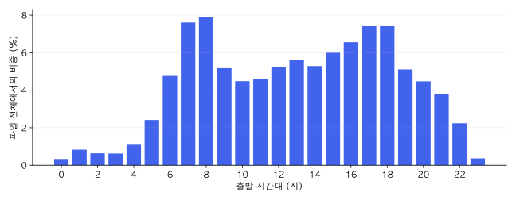
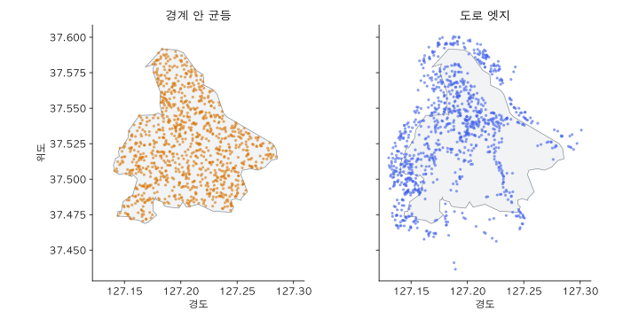
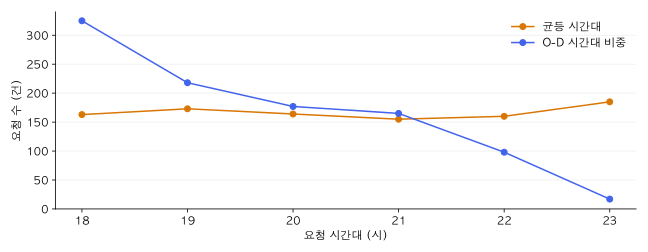
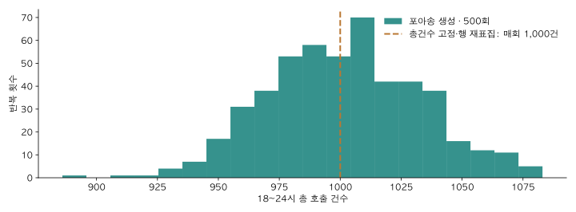

# 8장 통행 수요와 수요 생성기

통행 수요는 사람들이 언제, 어디서 어디로 얼마나 이동하려 하는지를 나타냅니다.
시뮬레이션에서는 이 수요를 입력으로 삼아 차량 대수와 배차 방식에 따른 승객 대기시간을 비교합니다.

수요를 관찰하는 자료에는 스마트카드 이용 이력, 통신사 집계표, 택시 승하차 기록, GPS 궤적이 있습니다.
자료마다 한 행이 뜻하는 대상이 다릅니다. 승차 한 번일 수도 있고, 수십 명을 합친 이동량이나 위치 점 하나일 수도 있습니다.
이 장에서는 네 자료의 구조를 비교한 뒤, 집계 자료를 시뮬레이션용 요청으로 바꾸는 가정을 살펴봅니다.
호출 시각과 출발지·목적지를 정하고, 총건수 고정·부트스트랩 재표집·포아송 발생을 비교합니다.

## 학습 목표

- 네 자료에서 한 행의 뜻과 관측되지 않는 정보를 구분합니다.
- 환승 구간 수, 집계 이동량, 승하차 건수, GPS 점 수의 차이를 설명합니다.
- 하남 O-D 예제의 시간대별 비중과 목적지 분포를 계산합니다.
- 위치·시각을 표집하는 조건에 따라 생성 수요가 어떻게 달라지는지 비교합니다.
- 총건수 고정·부트스트랩 재표집·포아송 발생의 평균과 변동을 비교합니다.

## 8.1 교통수요 자료의 관측 단위

같은 사람이 버스에서 지하철로 갈아탔다고 해 봅시다.
승차 횟수로 세면 두 번이고, 처음 출발지에서 최종 목적지까지의 이동으로 세면 한 번입니다.
휴대전화 위치가 100번 기록되었다고 통행이 100건이 되는 것도 아닙니다.
자료를 읽을 때는 먼저 **관측 단위**가 무엇인지 확인합니다.

다음 표는 연구실 NAS에서 확인한 네 자료의 구조를 비교합니다.
스마트카드 데이터(교통카드 이용 이력)는 환승을 연결한 표이고, GPS 자료는 AI Hub 원천을 연구실에서 정제한 표입니다.
컬럼 구성과 확인 범위는 [예제 자료 설명](../data/examples/demand_forms/README.md)에 정리했습니다.

| 자료                   | 한 행의 뜻                                      | 대표 필드                                                        | 수요로 바꿀 때 남는 문제                        |
| ---------------------- | ----------------------------------------------- | ---------------------------------------------------------------- | ----------------------------------------------- |
| 스마트카드 환승 연결표 | 환승 구간을 묶은 통행사슬 하나                  | `승차일시1`, `하차일시1`, `승차정류장역ID1`, `환승건수`  | 정류장까지의 접근 이동과 최종 목적지까지의 이동 |
| 통신사 500m 격자 O-D   | 요일·격자 쌍·시간대·성연령·목적별 집계 하나 | `O_ID`, `D_ID`, `O_TIME_CD`, `MOVE_CNT`                  | 개인별 위치·출발 시각, 택시로 이동할 비율      |
| 택시 승하차            | 승차부터 하차까지 한 건                         | `start_time`, `end_time`, `p_x`, `p_y`, `d_x`, `d_y` | 호출 시각, 승차 전 대기, 택시를 잡지 못한 요청  |
| GPS 점                 | 한 궤적의 한 시점 위치                          | `traj_uid`, `t_ms`, `lat`, `lon`                         | 통행의 시작·끝과 중간 체류, 기록 누락          |

> 아래 네 소절의 행과 계산값은 구조를 설명하기 위해 만든 교육용 예제입니다.
> NAS 원자료에서 뽑은 표본이 아닙니다. 실제 이용자의 식별자·이동 경로는 포함하지 않습니다.

### 8.1.1 스마트카드의 승차 구간과 환승 연결

스마트카드 자료는 승차·하차 시각을 정류장 또는 역 ID와 연결합니다.
확인한 환승 연결표는 한 행에 최대 10개 구간을 담습니다.
첫 구간에는 `승차일시1`·`하차일시1`, 다음 구간에는 `승차일시2`·`하차일시2`가 붙습니다.
정류장 ID로 위치를 알아내려면 정류장 좌표표와 연결합니다.

교육용 예제의 통행사슬 세 개를 구간별로 펼치면 다음과 같습니다.
연결번호 A·B·C와 정류장 S1~S4는 가상이며, 각 통행사슬의 이용객 수는 한 명으로 둡니다.

| 연결번호 | 구간 | 승차 → 하차 정류장 | 승차 → 하차 시각 |
| -------- | ---: | ------------------- | ----------------- |
| A        |    1 | S1 → S2            | 08:00 → 08:10    |
| A        |    2 | S2 → S3            | 08:15 → 08:35    |
| B        |    1 | S1 → S3            | 08:05 → 08:30    |
| C        |    1 | S4 → S2            | 09:00 → 09:12    |

A는 두 번 승차했지만 S1에서 S3으로 이어지는 통행사슬은 하나입니다.
그래서 이 표의 승차는 네 건이고 통행사슬은 세 개입니다.
A의 첫 승차부터 마지막 하차까지는 35분이며, 차량 안에서 보낸 30분과 환승 사이 5분으로 나뉩니다.
정류장에 오기 전의 이동과 마지막 하차 뒤의 이동은 이 표에 없습니다.

버스 노선의 탑승 수요를 구할 때는 구간별 승차를 셉니다.
출발지-목적지(O-D, origin–destination) 수요를 만들 때는 연결된 첫 승차와 마지막 하차를 사용할 수 있습니다.
다만 이 O-D의 양 끝은 집이나 직장 주소가 아니라 정류장입니다.
하차 기록이 빠진 구간은 목적지를 바로 정할 수 없습니다.

### 8.1.2 통신사의 집계 O-D와 전수화 통행량

통신사 자료는 위치 관측으로 이동을 추정하고, 공간·시간 구간별로 묶어 제공합니다.
연구실의 KT 500m 격자 자료는 2024년 11월의 요일별 집계표입니다.
같은 격자 쌍도 출발·도착 시간대, 성연령, 이동 목적에 따라 다른 행으로 나뉩니다.
`MOVE_CNT`는 관측 표본을 전체 규모로 환산한 **전수화 통행량**이어서 소수가 나올 수 있습니다.

다른 집계 조건을 같게 둔 교육용 표를 보겠습니다.

| 출발 격자`O_ID` | 도착 격자`D_ID` | 출발 시간대`O_TIME_CD` | 통행량`MOVE_CNT` |
| ----------------- | ----------------- | ------------------------ | -----------------: |
| A                 | B                 | 08                       |               12.5 |
| A                 | C                 | 08                       |                7.5 |
| A                 | B                 | 09                       |                5.0 |
| C                 | A                 | 09                       |               15.0 |

08시대 통행량은 12.5 + 7.5 = 20.0입니다. 09시대도 5.0 + 15.0 = 20.0입니다.
행은 네 개이지만 통행량 합계는 40.0입니다. 행 수를 세면 집계 조합 수를 구하게 됩니다.
12.5를 곧바로 승객 12명으로 바꾸면 행마다 반올림 오차가 쌓입니다.
먼저 분석 범위의 총량을 정하고, 각 O-D의 비중을 요청 생성 확률로 사용하는 방법을 생각할 수 있습니다.

격자 A에서 출발했다는 정보만으로는 A 안의 어느 건물에서 몇 분에 출발했는지 알 수 없습니다.
그 위치와 시각은 수요를 만들 때 추가하는 가정입니다.
통신사 이동량에 택시 이용 비율을 곱하면 택시 요청 수의 기댓값을 구할 수 있습니다.

### 8.1.3 택시의 승하차 기록과 호출 시각

연구실에 보관된 서울 택시 자료는 2018년 상반기 승하차 기록입니다.
한 행에 승차·하차 시각과 양 끝 좌표가 있어 O-D를 구성하기 쉽습니다.
다음은 별도로 만든 승하차 네 건의 예제입니다. 모두 같은 날짜에 출발하고 도착합니다.

| 예제 번호 | 승차 시각 | 하차 시각 | 승차부터 하차까지 |
| --------- | --------- | --------- | ----------------: |
| 1         | 08:00     | 08:12     |              12분 |
| 2         | 08:30     | 08:38     |               8분 |
| 3         | 18:00     | 18:20     |              20분 |
| 4         | 18:20     | 18:35     |              15분 |

첫 행의 차내시간은 08:12 − 08:00 = 12분입니다.
08:00에 탔다고 해서 08:00에 호출했다는 뜻은 아닙니다.
07:55에 호출했다면 승차 전 대기는 5분이지만, 승하차 기록만으로는 이 5분을 알 수 없습니다.
탑승하지 못하고 취소한 요청도 완료된 승하차 표에는 없습니다.

실습에서는 승차 시각을 요청 시각으로 대신 쓰는 가정을 명시합니다.
예제 좌표의 `p_x`·`d_x`는 경도, `p_y`·`d_y`는 위도로 정의했습니다.
NAS 택시 원자료는 좌표계 정의가 확인되지 않았으므로 이 대응을 그대로 적용하지 않습니다.
실제 좌표를 변환할 때는 정의서와 좌표 범위를 먼저 확인합니다.

### 8.1.4 GPS의 위치 점과 통행 구간

GPS(Global Positioning System) 궤적은 시간순 위치 점의 모음입니다.
[AI Hub 교통수단 판별 데이터][aihub]를 가공한 연구실 자료에는 점 표와 구간 표가 있습니다.
점 표의 `traj_uid`는 궤적을 묶는 번호이고, `t_ms`는 유닉스 기준시각부터 지난 밀리초입니다.
구간 표는 같은 궤적을 수단별 구간으로 나누고 시작·종료 시각을 기록합니다.
이 컬럼 구성은 연구실 정제본의 형식입니다.

예제 궤적 하나에서 시각을 한국 현지 시각으로 바꾸면 다음 네 점이 나옵니다.

| 궤적   | 시각  | 위도`lat` | 경도`lon` |
| ------ | ----- | ----------: | ----------: |
| 예제 1 | 08:00 |      37.540 |     127.200 |
| 예제 1 | 08:02 |      37.541 |     127.202 |
| 예제 1 | 08:05 |      37.545 |     127.210 |
| 예제 1 | 08:10 |      37.550 |     127.220 |

이 궤적을 끊김 없는 통행 하나로 가정하면 첫 점과 마지막 점이 O-D 후보가 됩니다.
관측 시간은 10분입니다. 네 행을 네 요청으로 넣으면 같은 통행을 중복하게 됩니다.
GPS 기록 간격을 더 짧게 바꾸면 점 수는 늘어도 이동한 사람 수는 늘지 않습니다.

실제 자료에서는 기록 시작 전에 이미 이동 중이었거나, 중간에 통신이 끊겼을 수 있습니다.
그래서 궤적의 첫 점과 마지막 점이 실제 출발·도착 장소인지 검토합니다.
수단별 구간을 묶는 기준에 따라 도보 접근과 차량 탑승을 별개 통행으로 셀 수도, 하나로 연결할 수도 있습니다.

[8장 실습 노트북](../labs/ch08_demand.ipynb)의 1절에서 네 예제를 짧은 코드로 계산합니다.
구간 펼치기, 통행량 합산, 시각 차이, 궤적 묶기를 각각 실행하고 위 결과와 비교합니다.

## 8.2 하남 O-D 예제의 시간대 패턴

이제 한 자료의 분포를 수요 생성에 사용해 보겠습니다.
교재의 `od_2024.parquet`는 출발·도착 행정동과 출발 시간대별 통행량을 담은 83,135행 표입니다.
앞 절의 KT 500m 격자 자료와는 다른 파일입니다.
집계 O-D의 공개 사례는 [서울 열린데이터광장의 수도권 생활이동][seoul]에서도 확인할 수 있습니다.

기존 원고는 이 파일을 수도권 생활이동의 하남 관련 발췌본으로 소개합니다.
그러나 저장된 파일에는 날짜와 발췌 이력이 없어 집계 기간을 확인할 수 없습니다.
여기서는 파일 안의 비중을 계산하며, 합계를 특정 날짜의 하루 통행량으로 해석하지 않습니다.

| 컬럼             | 뜻                | 이번 장에서의 사용               |
| ---------------- | ----------------- | -------------------------------- |
| `O_ADMDONG_CD` | 출발 행정동 코드  | 하남 출발 행 선택                |
| `D_ADMDONG_CD` | 도착 행정동 코드  | 목적지별 집계                    |
| `ST_TIME_CD`   | 출발 시간대, 0~23 | 시간대별 집계                    |
| `CNT`          | 집계 통행량       | 합계와 비중 계산                 |
| `MOVE_DIST`    | 이동거리 요약값   | 단위 재확인 전까지 계산에서 제외 |
| `MOVE_TIME`    | 이동시간 요약값   | 단위 재확인 전까지 계산에서 제외 |

그림 8.1은 파일의 모든 행을 시간대별로 묶어 `CNT`를 더한 결과입니다.
분모는 파일 전체의 `CNT` 합계 830,546.59입니다.

그림 8.1. 하남 O-D 예제의 24개 시간대 비중입니다. 파일 내부 분포이며, 특정 날짜의 관측 곡선으로 해석하지 않습니다.

| 출발 시간대 | `CNT` 합계 | 파일 전체에서 차지하는 비중 |
| ----------- | -----------: | --------------------------: |
| 00시        |     2,786.25 |                       0.34% |
| 03시        |     5,206.23 |                       0.63% |
| 08시        |    65,687.93 |                       7.91% |
| 17시        |    61,572.55 |                       7.41% |
| 18시        |    61,572.53 |                       7.41% |
| 23시        |     3,061.33 |                       0.37% |

이 파일에서는 08시대가 가장 높고 00시대가 가장 낮습니다.
08시와 17~18시의 봉우리는 출퇴근 시간대와 겹칩니다.
그러나 목적 컬럼이 없으므로 이 통행이 모두 출퇴근이라고 단정할 수는 없습니다.
03시대와 08시대의 비중은 약 12.6배 차이가 납니다.

## 8.3 하남 출발 통행의 목적지 분포

시간대 비중을 계산할 때는 하남으로 들어오는 행과 하남에서 나가는 행을 모두 사용했습니다.
이번에는 출발지가 하남인 행만 남깁니다.
이 파일의 행정동 코드는 여덟 자리이며, 앞 다섯 자리로 시군구를 구분합니다.
하남의 시군구 코드는 41450입니다.

하남 출발 행의 `CNT` 합계는 571,369.27이고, 목적지도 하남인 합계는 308,001.90입니다.
내부 통행 비중은 308,001.90 ÷ 571,369.27 = 53.9%입니다.
출발 행정동은 14개입니다. 이 값도 저장된 파일의 범위에서 계산한 결과입니다.

| 목적지   | 하남 출발 행의`CNT` 합계 | 하남 출발 전체에서의 비중 |
| -------- | -------------------------: | ------------------------: |
| 하남시   |                 308,001.90 |                     53.9% |
| 강동구   |                  54,218.65 |                      9.5% |
| 송파구   |                  41,810.67 |                      7.3% |
| 강남구   |                  17,923.09 |                      3.1% |
| 남양주시 |                  17,332.75 |                      3.0% |

하남시 경계 안만 모델링하면 하남에서 출발해 경계 밖으로 나가는 46.1%는 다루지 못합니다.
이 통행을 모두 삭제할지, 외부 출입 지점을 둘지, 도로망 범위를 넓힐지는 분석 질문에 따라 정합니다.
하남 밖 통행을 전부 서울 동남권으로 묶을 수도 없습니다. 남양주시처럼 다른 방향의 목적지도 있습니다.

## 8.4 시뮬레이션용 요청 목록

교재의 시뮬레이터는 한 행이 요청 하나인 표를 받습니다.
한 요청을 한 승객으로 다루며, 호출 시각과 양 끝 좌표를 다섯 컬럼으로 기록합니다.

| 컬럼             | 뜻                 | 표현 방식        |
| ---------------- | ------------------ | ---------------- |
| `request_time` | 요청이 발생한 시각 | 자정부터 지난 분 |
| `origin_lat`   | 출발지 위도        | WGS84, 도        |
| `origin_lon`   | 출발지 경도        | WGS84, 도        |
| `dest_lat`     | 목적지 위도        | WGS84, 도        |
| `dest_lon`     | 목적지 경도        | WGS84, 도        |

18:20의 요청 시각은 18 × 60 + 20 = 1100입니다.
8.1절 택시 예제의 네 번째 행을 옮기면 요청 시각은 1100, 출발지는 (위도 37.560, 경도 127.230)입니다.
목적지는 (위도 37.540, 경도 127.200)입니다. 승차 시각을 요청 시각으로 대신 쓴 가정도 함께 남깁니다.

자료마다 이 표에 이르는 과정이 다릅니다.
스마트카드는 정류장 좌표를 연결하고, 통신사 집계표는 요청 수와 구역 안 위치를 정합니다.
택시는 시각과 좌표 단위를 맞추며, GPS는 먼저 통행 경계를 정합니다.
다섯 컬럼이 모두 채워졌어도 호출 시각이나 이용 수단에 대한 가정이 검증된 것은 아닙니다.

## 8.5 경계 내부의 균등 위치 표집

개인별 출발·도착 위치가 없을 때는 행정구역 경계 안에서 위치를 뽑을 수 있습니다.
경계 안의 같은 면적이 같은 선택 확률을 갖게 하는 방법을 **균등 표집**이라고 합니다.
출발지와 목적지를 따로 뽑고, 이 실습에서는 두 점의 직선거리가 0.5km 이상인 쌍만 남깁니다.

그림 8.2의 왼쪽은 하남 경계 안에서 뽑은 요청 1,000건의 출발지입니다.
난수 시드는 42이고 시각 범위는 18:00 이상, 24:00 미만입니다.
산지나 하천도 경계 안에 있으면 위치 후보가 됩니다.
면적을 고르게 채우는 조건에는 토지 이용이나 차량 접근성 정보가 없기 때문입니다.

그림 8.2. 같은 요청 수와 시드로 생성한 출발지입니다. 왼쪽은 경계 내부, 오른쪽은 도로 엣지에서 위치를 뽑았습니다.

## 8.6 도로 엣지에 따른 위치 표집

그림 8.2의 오른쪽은 자동차 도로망의 엣지를 골라 그 위에서 위치를 뽑은 결과입니다.
교재 생성기는 엣지 양 끝의 직선거리에 비례해 엣지를 선택합니다.
길이가 100m인 엣지와 300m인 엣지만 있다면 선택 확률은 각각 25%, 75%입니다.
선택한 엣지에서는 양 끝을 잇는 선분 위의 위치를 고르게 뽑습니다.

도로 엣지를 사용하면 위치 후보가 도로망을 따릅니다.
사용한 도로망에는 경계 밖의 엣지도 있어 일부 출발지가 경계 바깥에 놓입니다.
다만 실제 도로의 굽은 형상을 모두 따르는 방식은 아니며, 승하차 가능한 도로인지도 구분하지 않습니다.
주택가의 짧은 도로보다 자동차 전용도로의 긴 엣지가 더 자주 선택될 수도 있습니다.

출발지와 목적지는 거리 조건을 적용하기 전까지 독립적으로 뽑습니다.
그래서 8.3절에서 본 행정동 간 O-D 관계는 아직 들어 있지 않습니다.
공간 분포를 더 반영하려면 O-D 쌍을 먼저 선택하고 각 구역 안의 위치를 뽑는 순서가 필요합니다.

## 8.7 시간대별 비중에 따른 시각 표집

위치를 정한 뒤에는 요청 시각을 정합니다.
시간을 균등하게 뽑으면 18시와 23시의 요청 확률이 같습니다.
반면 그림 8.1의 분포를 사용하면 통행 비중이 높은 시간대에 더 많은 요청이 생깁니다.

시간대별 비중은 그 시간대의 통행량을 전체 통행량으로 나눈 값입니다.
08시대는 65,687.93 ÷ 830,546.59로 계산한 약 7.91%입니다.
먼저 이 확률로 시간대를 고르고, 그 시간대 안에서 분 단위 시각을 균등하게 뽑습니다.
08시대를 골랐다면 08:00~08:59 중 한 시각이 됩니다.

18:00~24:00만 실험할 때는 이 여섯 시간대의 비중 합을 1로 다시 맞춥니다.
그래서 전체 파일에서 18시대 비중이 7.41%라고 해서 저녁 요청 중 7.41%만 18시에 배정하는 것은 아닙니다.

그림 8.3. 도로망·요청 수 1,000건·시드 42를 고정하고 시각 분포를 바꾼 결과입니다. 원자료 비중을 쓴 경우에도 표집 오차가 남습니다.

그림 8.3의 두 조건은 요청 총량이 같습니다. 하지만 차량이 부족해질 시간대는 달라질 수 있습니다.
시간대 비중을 맞추어도 위치는 여전히 도로 길이에 따라 뽑은 값입니다.
이 수요를 실제 하남 택시 호출의 재현으로 해석하려면 수단 비율과 O-D 관계도 검토해야 합니다.

## 8.8 수요 조건에 따른 서비스 결과 비교

만든 요청 목록을 같은 차량 조건에 넣으면 수요 분포의 영향을 비교할 수 있습니다.
실습에서는 차량 80대, 요청 1,000건, 18:00~24:00를 고정합니다.
도로 위에 위치를 뽑은 뒤 시각만 균등 분포와 하남 O-D 비중으로 바꿉니다.

비교 지표는 서비스율과 평균 대기시간입니다.
서비스율은 전체 요청 중 서비스를 받은 비율이고, 평균 대기시간은 서비스를 받은 요청에서 계산합니다.
평균 대기시간이 짧아도 서비스를 받지 못한 요청이 많을 수 있으므로 두 값을 함께 읽습니다.
결과는 교재 모형과 입력 가정 아래의 비교이며 실제 택시 운영 성능의 측정값은 아닙니다.

## 8.9 총건수 고정과 부트스트랩 재표집

앞 절에서는 호출을 매번 1,000건씩 만들었습니다.
총건수가 같아도, 무작위로 뽑은 시각과 위치는 실행마다 달라질 수 있습니다.
서비스 결과가 특정 요청 목록에만 나타나는지 살펴보려면 수요를 반복해서 생성합니다.
먼저 건수의 합을 고정한 상태에서 어떤 차이가 생기는지 살펴봅시다.

### 총건수를 고정한 시간대 표집

설명을 위해 18시대 비중이 30%, 나머지 다섯 시간의 비중 합이 70%라고 가정합니다.
각 요청이 18시대에 들어갈 확률을 0.3으로 두고 1,000번 뽑습니다.
18시대 건수의 기댓값은 $1{,}000\times0.3=300$건입니다.
실제로 뽑은 건수는 300보다 많거나 적을 수 있습니다.
그래도 여섯 시간의 건수를 더하면 언제나 1,000건입니다.

시간대별 건수를 $N_h$, 전체 건수를 $N$, 시간대 비중을 $p_h$라고 하면 다음 관계가 성립합니다.

$$
\sum_h N_h=N,\qquad E[N_h]=Np_h
$$

시간대별 건수의 묶음은 **다항분포**(multinomial distribution)를 따릅니다.
한 시간대에 요청이 더 배정되면 다른 시간대에 배정할 수 있는 요청 수가 줄어듭니다.
따라서 시간대별 건수는 서로 독립이 아닙니다.

고른 시간대 안에서는 호출 시각을 균등하게 뽑습니다.
이는 한 시간 안의 발생률이 일정하다는 가정입니다.
역에 열차가 도착한 직후처럼 짧은 시간에 호출이 몰리는 현상은 별도로 반영하지 않습니다.

### 기존 요청 행의 복원추출

호출 시각과 출발지·목적지가 함께 적힌 요청 목록이 이미 있다면 어떻게 활용할까요?
행을 통째로 다시 뽑으면 한 요청 안의 시간과 O-D 관계를 함께 가져올 수 있습니다.

**복원추출**(sampling with replacement)은 한 번 뽑은 대상을 다시 뽑을 수 있게 하는 표집입니다.
다음은 원리를 설명하기 위한 가상 요청 네 건입니다.

| 기준 요청 | 호출 시각 | 출발지 → 목적지 |
| --------- | --------- | ---------------- |
| A         | 18:02     | 주거지 → 역     |
| B         | 18:10     | 역 → 주거지     |
| C         | 18:35     | 상가 → 주거지   |
| D         | 19:05     | 주거지 → 상가   |

네 행을 같은 확률로 네 번 뽑으면, 한 가능한 결과는 B, B, D, A입니다.
B는 두 번 포함되고 C는 빠집니다.
B를 뽑을 때마다 호출 시각 18:10과 역 → 주거지라는 O-D 쌍을 함께 복사합니다.
시각과 출발지·목적지를 각각 따로 뽑으면 원래 행의 관계를 잃습니다.

**부트스트랩**(bootstrap)은 자료를 다시 구성하며 통계량의 변동을 추정하는 방법입니다.
여기서는 원자료와 같은 크기의 표본을 복원추출하는 방식을 다룹니다.
여기서는 그중 요청 행을 재표집하는 원리를 이용해 시뮬레이션용 목록을 다시 구성합니다.
통계량의 신뢰구간을 구하는 절차까지 수행하는 것은 아닙니다.
[CMU의 부트스트랩 강의][ch08-source-1]에서 재표집과 통계적 추론의 관계를 설명합니다.

기준이 1,000건이면 이 방법으로 만든 목록도 매번 1,000건입니다.
시간대별 건수와 O-D 쌍의 구성은 달라집니다.
같은 행이 반복될 수 있으므로 원자료의 1,000개 행이 모두 한 번씩 나타나는 것은 아닙니다.

이 방법은 기준 목록에 없는 위치나 새로운 O-D 쌍을 만들지 못합니다.
행을 독립적으로 뽑으므로, 여러 요청이 연속해서 몰리는 관계도 보존하지 못합니다.
이 관계가 중요하다면 연속된 시간 구간이나 하루 전체를 묶어서 뽑는 블록 재표집을 검토합니다.
그때는 같은 조건에서 관측한 시간 구간이나 날짜가 충분히 있어야 합니다.

## 8.10 포아송 분포와 호출 발생

총건수를 매번 1,000건으로 정하면, 호출이 많은 저녁과 적은 저녁의 차이는 실험에 들어가지 않습니다.
포아송 모형에서는 기대 총건수를 정하고 실제 건수를 무작위로 뽑습니다.

한 시간에 평균 10건이 발생한다고 가정해 봅시다.
평균이 10이라는 말은 매시간 정확히 10건이 발생한다는 뜻이 아닙니다.
어떤 시간에는 7건, 다른 시간에는 13건이 발생할 수 있습니다.

**포아송 분포**(Poisson distribution)는 정한 구간에서 발생하는 사건의 건수를 나타내는 분포입니다.
그 구간의 기대 건수를 $\mu$라고 할 때, $k$건이 발생할 확률은 다음과 같습니다.
[NIST의 분포 설명][ch08-source-2]에 확률식과 평균·표준편차가 정리되어 있습니다.

$$
P(N=k)=\frac{e^{-\mu}\mu^k}{k!},\qquad k=0,1,2,\ldots
$$

평균과 분산이 모두 $\mu$라는 점이 이 분포의 특징입니다.
기대 건수가 10건이면 표준편차는 $\sqrt{10}\approx3.16$건입니다.
기대 건수가 0이면 발생 건수도 항상 0입니다.

### 발생률과 구간 길이

**발생률**(arrival rate)은 단위 시간당 기대 건수입니다.
분당 발생률을 $\lambda$라 하고 구간 길이를 $\Delta t$분이라 하면, 기대 건수는 $\mu=\lambda\Delta t$입니다.

시간당 평균 10건은 분당 $10/60$건입니다.
이 발생률을 6분에 적용하면 기대 건수는 1건입니다.
분당 발생률에 시간 단위 구간 길이를 곱하면 단위가 맞지 않으므로, 계산 전에 시간 단위를 맞춥니다.

포아송 과정으로 호출 시각까지 만들 때는 서로 겹치지 않는 구간의 발생 건수가 독립이라고 가정합니다.
발생률이 일정한 구간에서 건수를 먼저 뽑은 뒤, 그 건수만큼의 시각을 구간 안에 균등하게 놓을 수 있습니다.
이 관계는 [MIT의 도착 시각 설명][ch08-source-3]에서 유도합니다.

### 시간대별로 다른 발생률

하남 예제처럼 시간대별 비중이 다르면, 여섯 시간의 기대 총건수 $\mu$를 시간대별로 나눕니다.

$$
\mu_h=\mu p_h,\qquad N_h\sim\operatorname{Poisson}(\mu_h)
$$

각 시간대의 $N_h$를 독립적으로 뽑습니다.
그 시간 안에서는 발생률이 일정하다고 가정하고 호출 시각을 정합니다.
18시대에는 많이, 23시대에는 적게 발생하면서도 실행마다 건수가 달라집니다.

설명용 비중 $p_{18}=0.3$과 기대 총건수 $\mu=1{,}000$을 쓰면, 18시대의 기대 건수는 300건입니다.
고정 방식과 기댓값은 같지만, 이번에는 전체 건수도 달라집니다.
독립인 시간대별 포아송 건수의 합도 포아송 분포를 따릅니다.
따라서 총건수의 표준편차는 $\sqrt{1{,}000}\approx31.6$건입니다.

### 포아송 가정의 한계

같은 요일·시간대라도 비가 오거나 행사가 끝난 직후에는 호출이 함께 늘 수 있습니다.
고정된 발생률과 독립 발생을 가정하면 이런 변동을 작게 표현할 수 있습니다.

실제 자료를 적용할 때는 같은 조건의 시간대들을 모아 건수의 평균과 분산을 비교합니다.
하루 안의 서로 다른 시간대를 한꺼번에 비교하면, 시간대별 평균 차이와 무작위 변동이 섞입니다.
한 개 집계 프로파일만으로 날짜별 분산이나 독립 발생 가정이 맞는지 판단할 수는 없습니다.

## 8.11 수요 생성 방법과 반복 실험

세 방법은 어떤 양을 고정하고 어떤 양을 바꾸는지가 다릅니다.
다음 표에서 총건수와 기대 총건수는 모두 1,000건으로 설정합니다.

| 비교 항목                | 총건수 고정             | 요청 행 재표집             | 포아송 발생                    |
| ------------------------ | ----------------------- | -------------------------- | ------------------------------ |
| 전체 호출 수             | 항상 1,000건            | 항상 1,000건               | 평균 1,000건                   |
| 시간대별 호출 수         | 선택한 비중에 따라 변동 | 기준 행의 비중에 따라 변동 | 시간대별 기대 건수에 따라 변동 |
| 호출 시각                | 고른 시간대 안에서 표집 | 기준 행의 시각을 유지      | 시간대별 건수를 뽑은 뒤 표집   |
| 출발지·목적지           | 경계·도로 등 별도 규칙 | 기준 행의 쌍을 함께 유지   | 시간과 별도로 위치 규칙 설정   |
| 총건수의 이론적 표준편차 | 0건                     | 0건                        | 약 31.6건                      |

포아송 분포는 위치를 정해 주지 않습니다.
포아송 건수로 호출 시각을 만든 뒤, 위치는 도로에서 뽑거나 기존 O-D 쌍에서 가져올 수 있습니다.
건수·시각을 정하는 가정과 위치를 정하는 가정을 구분해서 기록합니다.

그림 8.4. 18~24시의 기대 총건수를 1,000건으로 두고 포아송 수요를 500번 생성한 결과입니다.
시간대 비중은 저장소 O-D 집계값이며 난수 씨앗은 42~541입니다.
점선은 총건수 고정과 행 재표집에서 매번 얻는 1,000건을 표시합니다.

이 반복의 총건수 평균은 1,001.5건, 표준편차는 31.4건입니다.
이론값인 평균 1,000건과 표준편차 약 31.6건에 가깝지만, 유한한 횟수로 계산한 값이라 차이가 남습니다.

그림 8.4에서 포아송 총건수가 퍼지는 것은 설정한 모형이 만드는 변동입니다.
이 폭을 실제 하남시의 날짜별 수요 변동으로 해석할 수는 없습니다.
실제 날짜별 기록과 비교해야 그 가정의 적절성을 판단할 수 있습니다.

[수요 생성 실험실 HTML](../_static/ch08_demand.html)에서 세 방법을 비교할 수 있습니다.
화면에는 시간대별 호출 수, 지도 위 O-D 쌍, 500회 반복 분포가 함께 표시됩니다.
HTML은 별도 파일로 열리며, 본문에서 설명한 가정에 따른 결과를 확인하는 자료입니다.

기준 자료는 저장소의 예제 요청 1,000건이며, 실제 택시 호출의 관측 표본으로 간주하지 않습니다.
HTML의 총건수 고정·포아송 방식은 위치 차이의 영향을 줄이기 위해 같은 시간대의 예제 O-D 쌍을 가져옵니다.
행 재표집은 분 단위 호출 시각까지 함께 가져옵니다.
노트북에서는 도로에서 위치를 뽑는 방법도 비교합니다.

먼저 건수 1,000과 예제 요청의 시간대 비중을 선택해 총건수 고정과 포아송 결과를 비교해 봅시다.
두 방식의 시간대별 기댓값은 같지만 반복 총건수의 분포가 달라집니다.
이어서 행 재표집을 선택하면 같은 기준 행이 반복되는 모습을 확인할 수 있습니다.

차량 운영안을 비교할 때는 각 반복에서 만든 요청 목록 하나를 두 운영안에 공통으로 사용합니다.
다음 반복에서는 새 목록을 만들되, 그 목록도 두 운영안에 같이 적용합니다.
이렇게 하면 운영안 사이의 차이와 수요가 달라져 생긴 변동을 구분하기 쉽습니다.

## 이 장의 실습

[8장 실습 노트북](../labs/ch08_demand.ipynb)에서 네 자료의 작은 예제를 계산합니다.
이어 하남 파일의 비중을 구하고, 경계·도로·시간대 조건을 바꾼 요청 목록을 생성합니다.
실습 7절에서는 생성 수요를 교재의 시뮬레이션 루프에 넣어 서비스율과 대기시간을 비교합니다.
예제 파일은 교재에 포함되어 있어 NAS 접속 없이 실행할 수 있습니다.
노트북 9절에서는 요청 행 재표집과 포아송 발생을 실행하고 반복 평균·표준편차를 비교합니다.

## 정리

- 스마트카드의 승차 구간, 통신사의 집계량, 택시 승하차 한 건, GPS 점은 서로 다른 단위입니다.
- 집계 통행량은 값의 합으로 계산하고, 환승이나 GPS 기록은 통행 단위로 묶어 해석합니다.
- 하남 예제 파일의 하남 출발 통행 중 53.9%는 목적지도 하남입니다. 집계 기간은 파일에서 확인되지 않습니다.
- 총건수 고정과 같은 크기의 행 재표집은 요청 수가 일정합니다. 포아송 발생은 기대 건수를 정하고 실제 건수는 무작위로 뽑습니다.
- 9장에서는 요청의 출발지와 목적지를 사용해 통행시간을 예측합니다.

## 연습문제

### 연습 8.1 ★

8.1절 스마트카드 예제에서 A의 두 번째 구간을 삭제한다고 가정해 봅시다.
승차 건수와 통행사슬 수, A의 최종 하차 지점이 어떻게 달라지는지 설명해 봅시다.
산출물은 변경 전후 비교 세 문장입니다.

### 연습 8.2 ★★

하남 파일에서 오전 07~09시대와 저녁 17~19시대의 O-D 쌍을 비교해 봅시다.
각 시간 범위의 통행량 상위 10쌍은 [실습 노트북](../labs/ch08_demand.ipynb)의 연습 코드로 계산합니다.
출발지와 목적지가 뒤바뀐 쌍이 있는지 찾고, 통행 목적까지 단정할 수 있는지 설명해 봅시다.
산출물은 상위 10쌍 표 두 개와 해석 세 문장입니다.

### 연습 8.3 ★★★

분석 기간이 확인된 총 이동량 중 택시를 이용할 비율을 2%로 가정해 봅시다.
이 비율을 1%, 2%, 3%로 바꾸면 요청 수는 어떻게 달라지는지 계산해 봅시다.
하남 예제 파일을 사용한다면 집계 기간이 미확인이라는 한계도 적습니다.
산출물은 가정별 요청 수 세 개와, 실제 택시 수요로 해석하기 위해 더 필요한 정보 두 가지입니다.

### 연습 8.4 평균이 같은 수요 모형 ★★

총건수 1,000건의 고정 방식과 기대 총건수 1,000건의 포아송 방식을 비교해 봅시다.
18시대 비중은 두 방식 모두 30%로 둡니다.
산출물은 두 방식의 총건수 평균·분산, 18시대 기대 건수와 시간대별 건수의 독립성에 대한 설명입니다.

### 연습 8.5 재표집 단위 ★★★

8.9절의 네 요청을 개별 행으로 뽑는 경우와, 18시대의 세 요청을 한 묶음으로 뽑는 경우를 비교해 봅시다.
산출물은 각 방법의 가능한 재표집 결과 한 개와, 호출이 몰리는 관계 중 무엇을 유지하는지에 대한 설명입니다.

## 더 읽을거리

- [예제 자료 설명][examples]: NAS 자료의 구조와 교육용 값의 가정을 구분합니다.
- [서울 열린데이터광장, 수도권 생활이동][seoul]: 이동량의 공간·시간 집계 단위를 확인합니다.
- [AI Hub, 교통수단 판별 데이터][aihub]: GPS와 교통수단 정보를 사용하는 원천 자료를 확인합니다.
- [CMU, The Bootstrap][ch08-source-1]: 재표집과 블록 재표집의 원리를 설명합니다.
- [NIST, Poisson Distribution][ch08-source-2]: 확률식과 평균·표준편차를 확인합니다.
- [MIT, 도착 시각의 분포][ch08-source-3]: 건수를 뽑은 뒤 도착 시각을 균등하게 정하는 이유를 유도합니다.

[examples]: ../data/examples/demand_forms/README.md
[seoul]: https://data.seoul.go.kr/dataVisual/seoul/capitalRegionLivingMigration.do
[aihub]: https://www.aihub.or.kr/aihubdata/data/view.do?aihubDataSe=data&dataSetSn=71545
[ch08-source-1]: https://stat.cmu.edu/~cshalizi/dst/18/lectures/18/lecture-18.html
[ch08-source-2]: https://www.itl.nist.gov/div898/handbook/eda/section3/eda366j.htm
[ch08-source-3]: https://web.mit.edu/urban_or_book/www/book/chapter2/2.12.3.html
